# Microsoft Agent Framework vs OpenAI Agents SDK
## A Comprehensive, Exhaustive, Definitive Comparative Analysis


> **Document Status:** Current as of May 2026 | MAF v1.0 GA (April 3, 2026) | OpenAI Agents SDK (continuously updated, April 2026 evolution)
> 
> **Scope:** This document covers every architectural, functional, operational, developer-experience, and strategic dimension of both frameworks. It is intended as the single authoritative reference for teams evaluating, adopting, or migrating between these platforms.

---

## Table of Contents

1. [Executive Summary](#1-executive-summary)
2. [Lineage & Origin Story](#2-lineage--origin-story)
3. [Philosophy & Design Principles](#3-philosophy--design-principles)
4. [Architecture Deep Dive](#4-architecture-deep-dive)
5. [Core Primitives & Building Blocks](#5-core-primitives--building-blocks)
6. [Agent Definition & Configuration](#6-agent-definition--configuration)
7. [Multi-Agent Orchestration Patterns](#7-multi-agent-orchestration-patterns)
8. [Tool Integration & Ecosystem](#8-tool-integration--ecosystem)
9. [Memory & State Management](#9-memory--state-management)
10. [Communication Patterns & Protocols](#10-communication-patterns--protocols)
11. [Guardrails, Safety & Content Filtering](#11-guardrails-safety--content-filtering)
12. [Observability, Tracing & Monitoring](#12-observability-tracing--monitoring)
13. [Model Support & Provider Ecosystem](#13-model-support--provider-ecosystem)
14. [Human-in-the-Loop (HITL) Capabilities](#14-human-in-the-loop-hitl-capabilities)
15. [Workflows & Deterministic Orchestration](#15-workflows--deterministic-orchestration)
16. [Sandbox & Execution Environments](#16-sandbox--execution-environments)
17. [Language Support & SDK Surface](#17-language-support--sdk-surface)
18. [Deployment, Scaling & Infrastructure](#18-deployment-scaling--infrastructure)
19. [Security, Authentication & Governance](#19-security-authentication--governance)
20. [Developer Experience & Tooling](#20-developer-experience--tooling)
21. [Voice & Multimodal Capabilities](#21-voice--multimodal-capabilities)
22. [Enterprise Readiness](#22-enterprise-readiness)
23. [Open Standards & Interoperability](#23-open-standards--interoperability)
24. [Performance & Latency Characteristics](#24-performance--latency-characteristics)
25. [Pricing, Licensing & Cost Model](#25-pricing-licensing--cost-model)
26. [Community, Support & Ecosystem](#26-community-support--ecosystem)
27. [Migration Paths & Upgrade Stories](#27-migration-paths--upgrade-stories)
28. [Use Case Suitability Matrix](#28-use-case-suitability-matrix)
29. [Limitations & Known Gaps](#29-limitations--known-gaps)
30. [Code Examples: Side-by-Side](#30-code-examples-side-by-side)
31. [Decision Framework](#31-decision-framework)
32. [Feature Comparison Master Table](#32-feature-comparison-master-table)
33. [Future Roadmap & Strategic Direction](#33-future-roadmap--strategic-direction)
34. [Conclusion](#34-conclusion)

---

## 1. Executive Summary

### What Are These Frameworks?

**Microsoft Agent Framework (MAF) v1.0** is the production-ready, open-source, enterprise-grade successor to both AutoGen and Semantic Kernel — released in General Availability on April 3, 2026. It is a unified SDK and runtime for building AI agents and multi-agent workflows in Python and .NET, combining AutoGen's innovative multi-agent orchestration patterns with Semantic Kernel's enterprise-grade features: session-based state management, type safety, middleware, telemetry, and extensive model support. MAF adds graph-based workflows for explicit multi-agent orchestration and is deeply integrated into the Azure/Microsoft Foundry ecosystem.

**OpenAI Agents SDK** is a lightweight, minimalist, open-source Python and TypeScript framework launched in March 2025, evolved from OpenAI's experimental Swarm project. It was most recently expanded in April 2026 with configurable memory, sandbox-aware orchestration, Codex-like filesystem tools, and standardized integrations with sandbox environments. It is built around five core primitives — Agents, Tools, Handoffs, Guardrails, and Sessions/Tracing — and is designed for rapid developer productivity, being provider-agnostic while being optimized for OpenAI models.

### TL;DR Comparison

| Dimension | Microsoft Agent Framework | OpenAI Agents SDK |
|---|---|---|
| **Philosophy** | Enterprise-grade, graph-based, batteries-included | Minimalist, developer-first, primitive-based |
| **Target Audience** | Enterprise .NET/Python teams, Azure-native | Python/TypeScript developers, OpenAI-native |
| **Orchestration Model** | Graph workflows + LLM-driven agents | Explicit handoffs + agent-as-tool |
| **State Management** | Session-based, persistent, checkpointed | Session-based, in-memory, configurable |
| **Complexity** | Higher learning curve, higher power | Low entry barrier, composable |
| **Standards** | MCP + A2A protocol | MCP + AGENTS.md |
| **Model Agnosticism** | High (Azure, OpenAI, Anthropic, Google, Ollama) | High (100+ LLMs via Chat Completions) |
| **Enterprise Features** | Azure Monitor, Entra ID, CI/CD, YAML agents | OpenAI dashboard tracing, custom processors |
| **GA Status** | v1.0 GA (April 2026) | Production-ready (March 2025, evolving) |

---

## 2. Lineage & Origin Story

### Microsoft Agent Framework: The Convergence Narrative

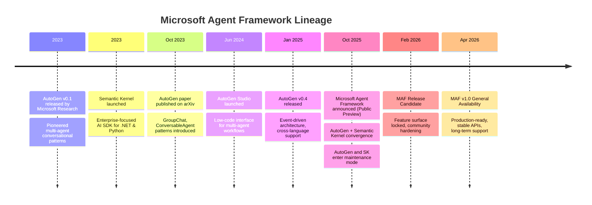

**AutoGen** was pioneered by Microsoft Research's AI Frontiers Lab as an experimental framework for multi-agent orchestration. It opened the door to patterns like GroupChat (collaborative multi-agent reasoning), conversational agent loops, and dynamic task delegation. AutoGen is now in maintenance mode — it will not receive new features or enhancements.

**Semantic Kernel** provided the enterprise counterpart: a production-focused AI SDK for .NET and Python with plugins, memory connectors, planners, type safety, and deep integration with Azure services.

**Microsoft Agent Framework** is the direct successor to both, created by the same teams, officially replacing them with a single unified platform.

### OpenAI Agents SDK: The Swarm Evolution

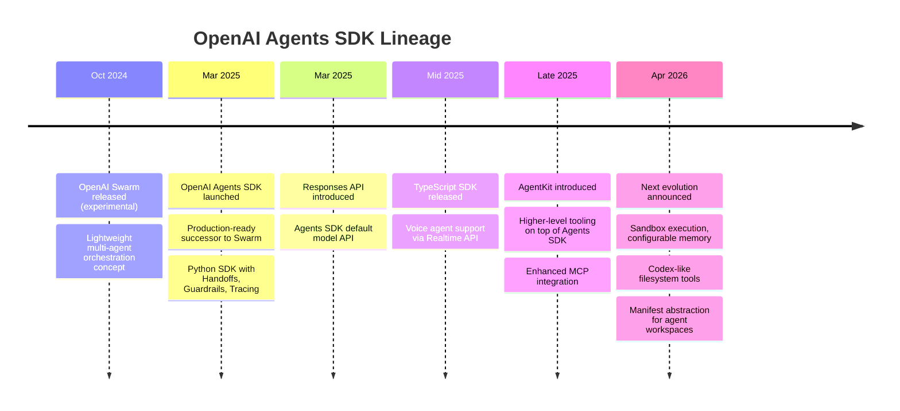

OpenAI's SDK replaced the experimental Swarm framework with a production-grade toolkit focused on making multi-agent workflows accessible through minimal, composable primitives.

---

## 3. Philosophy & Design Principles

### Microsoft Agent Framework Philosophy

MAF embodies a **"structured enterprise innovation"** philosophy:

1. **Explicit over Implicit**: Graph-based workflows give developers explicit control over multi-agent execution paths. Nothing happens by magic.
2. **Enterprise-First**: Every feature is designed with production concerns in mind — durability, governance, observability, security from day one.
3. **Research-to-Production Bridge**: AutoGen's innovative multi-agent patterns (GroupChat, Magentic-One) are made enterprise-deployable without sacrificing the research community's ability to experiment.
4. **Separation of Concerns**: Clear distinction between Agents (LLM-driven, autonomous reasoning) and Workflows (deterministic, graph-based execution). Microsoft's own documentation advises: *"if a task can simply be handled by a normal function, do that instead of using an AI agent."*
5. **Open Standards as Infrastructure**: MCP and A2A are not integrations — they are the foundation of cross-framework agent collaboration.
6. **Convergence not Replacement**: MAF builds on AutoGen and Semantic Kernel rather than discarding them.

### OpenAI Agents SDK Philosophy

The Agents SDK embodies a **"primitive minimalism"** philosophy:

1. **Minimum Viable Abstraction**: Provide only the primitives needed to build any agent system (Agents, Tools, Handoffs, Guardrails, Tracing) and let developers compose freely.
2. **Model-Native**: Designed to align with how frontier OpenAI models perform best, not as a model-agnostic compatibility layer.
3. **Production via Simplicity**: The framework achieves production readiness not through heavyweight enterprise features but through correctness of its core primitives.
4. **Developer Delight**: Learnable in an afternoon. A "hello world" agent runs in under 10 lines.
5. **Provider-Agnostic by Design**: While optimized for OpenAI, supports 100+ LLMs through the Chat Completions API standard.
6. **Progressive Complexity**: Simple tasks stay simple; complex orchestration is achievable through composition of the same primitives.

### Philosophy Comparison Diagram

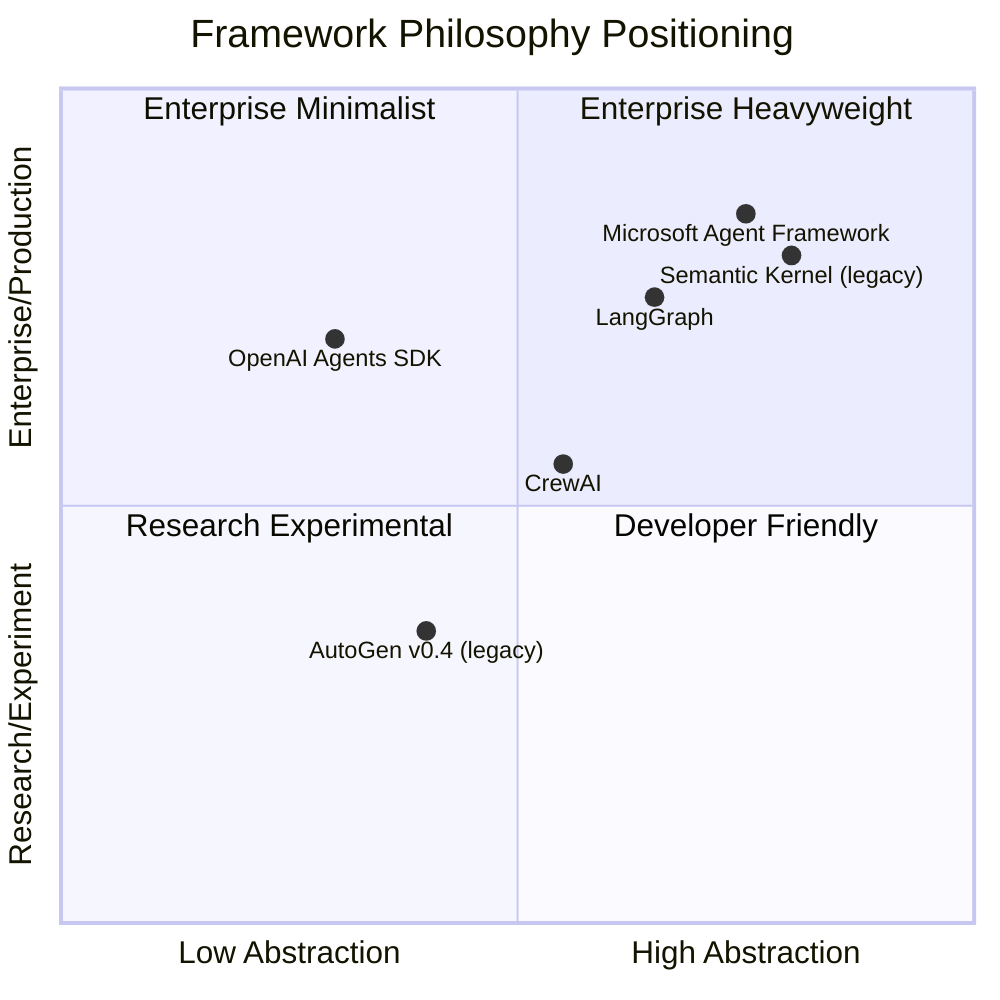

---

## 4. Architecture Deep Dive

### Microsoft Agent Framework Architecture

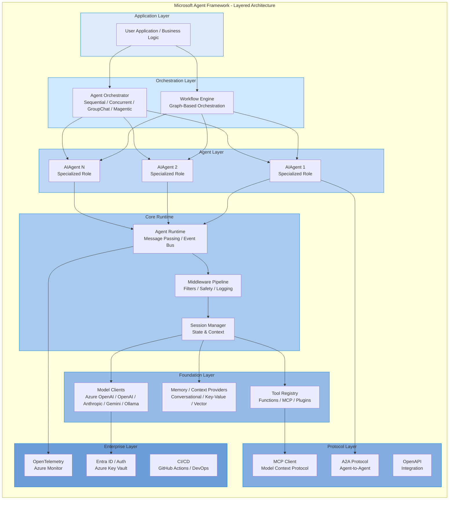

**Key MAF Architectural Principles:**

- **Event-Driven Runtime**: Inherited from AutoGen v0.4, messages flow through an event bus, enabling async, distributed execution
- **Layered Abstraction**: From high-level Workflow API down to raw Model Client — developers choose their abstraction level
- **Stateful Execution Units**: Agents are not mere prompt wrappers; they are stateful actors with memory, tools, and lifecycle management
- **Middleware Pipeline**: Every agent execution passes through an injectable middleware chain for cross-cutting concerns (safety, logging, compliance) without modifying agent prompts
- **Graph-Based Workflows**: Deterministic orchestration engine with type-safe routing, checkpointing, and human-in-the-loop support

### OpenAI Agents SDK Architecture

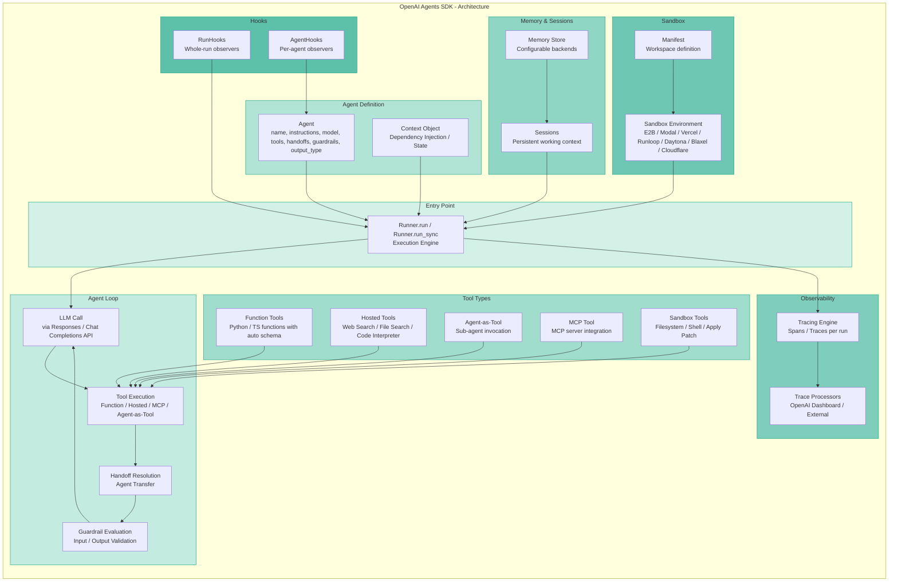

**Key OpenAI Agents SDK Architectural Principles:**

- **Simple Agentic Loop**: The Runner drives an autonomous loop of LLM call → tool execution → reasoning → output, handling all the turns automatically
- **Agent as Configuration Object**: Agents are not complex state machines — they are configuration objects with instructions, model, tools, and handoffs
- **Handoff as First-Class Citizen**: Agent delegation is represented as a native tool call to the LLM, making multi-agent coordination feel natural
- **Parallel Guardrails**: Safety/validation runs concurrently with agent execution, failing fast without blocking the main reasoning thread
- **Trace-Everything-by-Default**: Every agent run automatically emits structured traces capturing LLM calls, tool calls, handoffs, and guardrail checks

---

## 5. Core Primitives & Building Blocks

### Microsoft Agent Framework Core Primitives

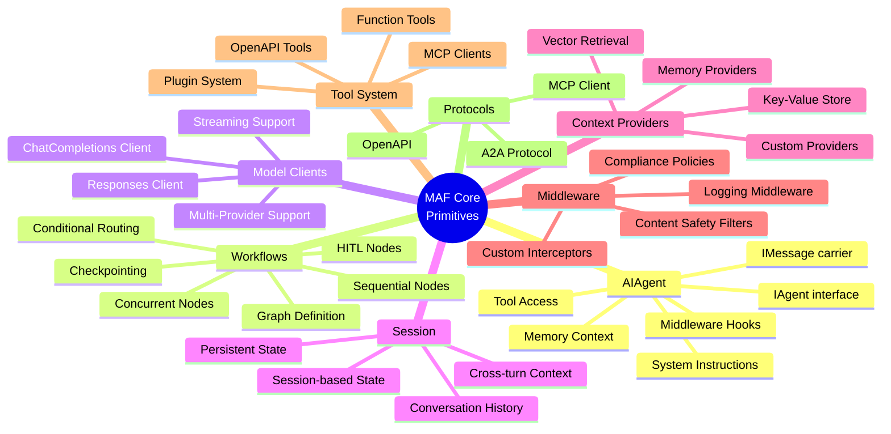

**MAF Primitive Descriptions:**

| Primitive | Description | Enterprise Significance |
|---|---|---|
| **AIAgent** | Stateful execution unit with LLM reasoning, tools, memory, and middleware | Core autonomous actor; not just a prompt wrapper |
| **IAgent** | Interface contract for all agents — defines identity, instructions, and message handling | Enables custom agent implementations |
| **IMessage** | Universal information carrier with sender, recipient, intent, and structured tool data | Type-safe communication between agents |
| **Workflow** | Graph-based deterministic orchestration engine with type-safe routing | Brings predictability to complex multi-step processes |
| **WorkflowNode** | Individual step in a workflow (agent, function, condition, HITL gate) | Fine-grained execution control |
| **AgentSession** | Session-scoped state manager for conversational history and persistent context | Critical for long-running enterprise workflows |
| **ContextProvider** | Pluggable memory backend (vector, key-value, conversation history) | Enables enterprise data integration |
| **Middleware** | Injectable execution pipeline for cross-cutting concerns | Zero agent-prompt modification for compliance, safety, audit |
| **ModelClient** | Unified abstraction over multiple AI provider APIs | Prevents vendor lock-in |
| **MCPClient** | Client for consuming MCP-compliant tool servers | Dynamic tool discovery without custom integrations |

### OpenAI Agents SDK Core Primitives

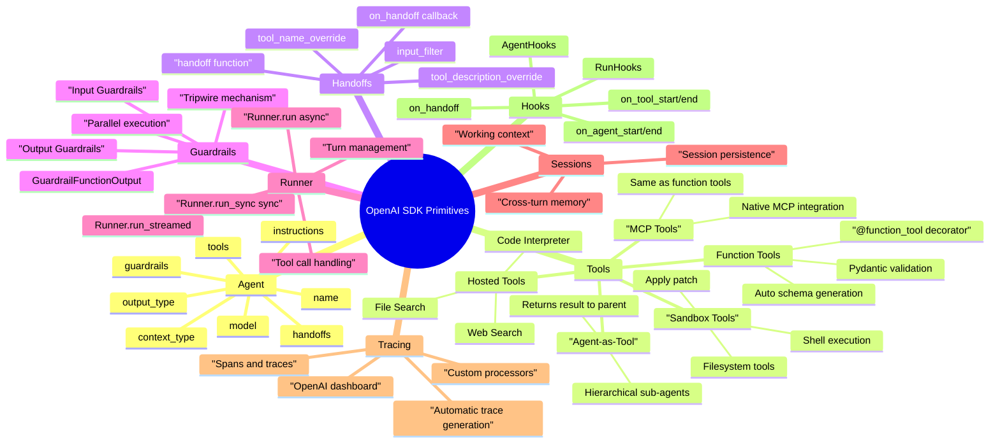

**OpenAI SDK Primitive Descriptions:**

| Primitive | Description | Design Choice Significance |
|---|---|---|
| **Agent** | Configuration object with instructions, model, tools, handoffs, guardrails | Intentionally simple — easy to create, test, compose |
| **Function Tool** | Any Python/TS function → tool via decorator with automatic schema generation | Eliminates boilerplate; Pydantic-powered type safety |
| **Hosted Tool** | OpenAI-managed capabilities (web search, file search, code interpreter) | Managed reliability, no self-hosting required |
| **Agent-as-Tool** | Child agent invoked as a tool; parent retains control | Hierarchical composition distinct from handoffs |
| **Handoff** | Full conversation transfer to another agent; receiving agent takes over | LLM-native routing via tool call representation |
| **Guardrail** | Parallel input/output validation with tripwire fast-fail | Non-blocking safety without slowing main reasoning |
| **Runner** | Execution engine managing the complete agentic loop | Single entry point for all execution modes |
| **Session** | Persistent memory layer for maintaining working context | Stateful agent experiences without manual state management |
| **RunHook / AgentHook** | Observable callbacks at every execution stage | Introspection and side effects without modifying agents |
| **Trace / Span** | Structured execution record for debugging and monitoring | Automatic observability with zero configuration |

---

## 6. Agent Definition & Configuration

### MAF Agent Definition

**Python:**
```python
from agent_framework import AIAgent, AgentSession
from agent_framework.tools import function_tool
from agent_framework.memory import ConversationalMemory

@function_tool
def search_database(query: str) -> list[dict]:
    """Search the enterprise database for records."""
    return db.query(query)

agent = AIAgent(
    name="data_analyst",
    instructions="""You are an enterprise data analyst. 
    Use the database tools to answer questions with precise data.""",
    model="azure-openai/gpt-5.4",
    tools=[search_database],
    session=AgentSession(
        memory=ConversationalMemory(max_turns=50),
        state_backend="redis://..."
    ),
    middleware=[ContentSafetyMiddleware(), AuditLoggingMiddleware()]
)
```

**Declarative YAML Definition (MAF):**
```yaml
# agent-definition.yaml
name: data_analyst
model: azure-openai/gpt-5.4
instructions: |
  You are an enterprise data analyst. 
  Use the database tools to answer questions with precise data.
tools:
  - type: function
    name: search_database
  - type: mcp
    server: enterprise-data-mcp
memory:
  type: conversational
  max_turns: 50
  persistent: true
  backend: redis
middleware:
  - ContentSafetyFilter
  - AuditLogger
```

**C# / .NET Definition:**
```csharp
var agent = new AIAgent(
    name: "data_analyst",
    instructions: "You are an enterprise data analyst...",
    model: "azure-openai/gpt-5.4",
    tools: [new FunctionTool(SearchDatabase)],
    session: new AgentSession(
        memory: new ConversationalMemory(maxTurns: 50)
    )
);
```

### OpenAI SDK Agent Definition

**Python:**
```python
from agents import Agent, function_tool
from pydantic import BaseModel

class AnalysisResult(BaseModel):
    summary: str
    confidence: float
    data_points: list[str]

@function_tool
def search_database(query: str) -> list[dict]:
    """Search the database for records matching the query."""
    return db.query(query)

agent = Agent(
    name="data_analyst",
    instructions="""You are a data analyst. 
    Use the database tools to answer questions with precise data.""",
    model="gpt-4.1",
    tools=[search_database],
    output_type=AnalysisResult,  # Structured output
    guardrails=[content_safety_guardrail],
)
```

**TypeScript:**
```typescript
import { Agent, tool } from "@openai/agents";
import { z } from "zod";

const searchDatabase = tool({
  name: "search_database",
  description: "Search the database for records",
  parameters: z.object({ query: z.string() }),
  execute: async ({ query }) => db.query(query),
});

const agent = new Agent({
  name: "data_analyst",
  instructions: "You are a data analyst...",
  model: "gpt-4.1",
  tools: [searchDatabase],
});
```

### Configuration Comparison

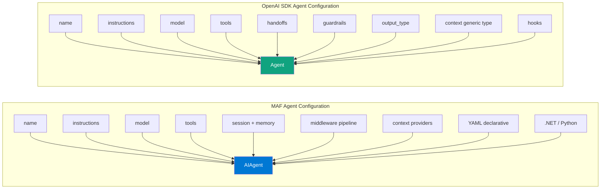

**Key Differences in Agent Configuration:**
- MAF uses a **session** object for state; OpenAI SDK has **sessions** as a separate runtime concept
- MAF has **middleware** as a first-class pipeline; OpenAI SDK uses **hooks** for observability
- MAF supports **YAML declarative** definitions for version-controlled agents; OpenAI SDK is code-first only
- OpenAI SDK has native **handoffs list** on the agent; MAF handles handoffs through workflow graph edges
- Both support **structured output** via Pydantic/typed models

---

## 7. Multi-Agent Orchestration Patterns

### MAF Orchestration Patterns

MAF ships with five stable multi-agent orchestration patterns, plus graph-based workflows as a separate deterministic orchestration layer:

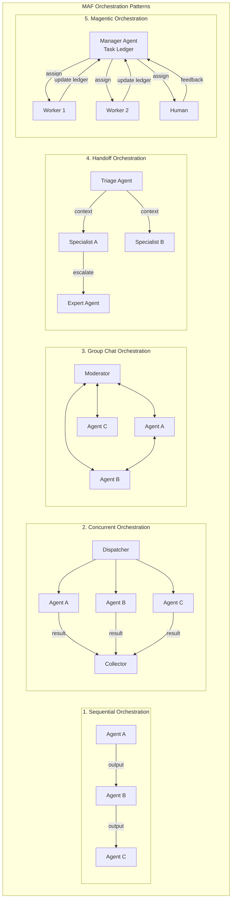

**MAF Workflow Graph Orchestration:**

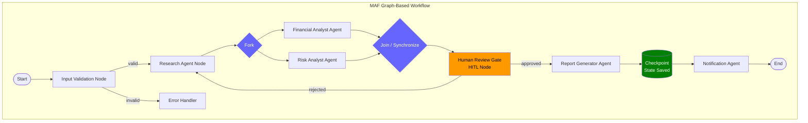

### OpenAI SDK Orchestration Patterns

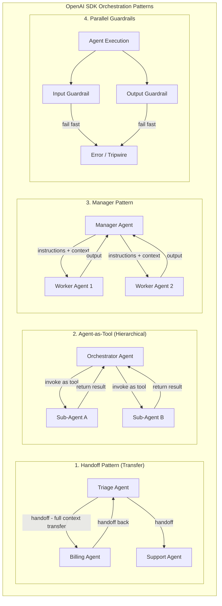

### Orchestration Pattern Deep Comparison

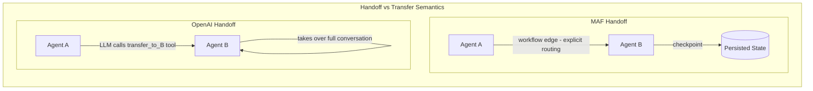

| Orchestration Aspect | Microsoft Agent Framework | OpenAI Agents SDK |
|---|---|---|
| **Sequential** | Graph node chain | Handoff chain |
| **Parallel** | Concurrent workflow nodes with join | Agent-as-tool parallel invocation |
| **Group Chat** | Native GroupChat pattern (from AutoGen) | Not native; composable with custom logic |
| **Manager/Worker** | Magentic-One pattern | Manager agent pattern via agent-as-tool |
| **Dynamic Routing** | Graph conditional edges | LLM decides handoff target |
| **Handoff Semantics** | Workflow edge with state transfer | Full conversation ownership transfer |
| **Agent-as-Tool** | Supported | Native, distinct from handoffs |
| **Checkpointing** | Native, persistent state saves | Session-based, configurable |
| **Human-in-the-Loop** | First-class workflow node type | Built-in interrupt mechanisms |
| **Cross-Runtime** | A2A protocol (.NET ↔ Python ↔ other) | Same-runtime only (Python or TypeScript) |
| **Deterministic Control** | Graph workflows provide full determinism | Handoffs are LLM-driven (probabilistic) |

---

## 8. Tool Integration & Ecosystem

### MAF Tool System

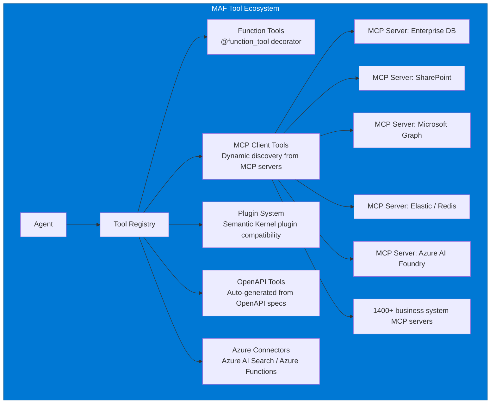

**MAF Tool Registration:**
```python
# Function tool
@function_tool
def query_crm(customer_id: str) -> dict:
    """Retrieve customer data from CRM."""
    return crm.get_customer(customer_id)

# MCP server tool (dynamic discovery)
mcp_client = MCPClient("enterprise-systems-mcp-server")
agent = AIAgent(tools=[query_crm, mcp_client])

# YAML-based tool definition
# tools.yaml
tools:
  - name: query_crm
    type: function
    module: myapp.tools
  - name: enterprise_mcp
    type: mcp
    server_url: "https://mcp.enterprise.com/sse"
    auth: EntraID
```

### OpenAI SDK Tool System

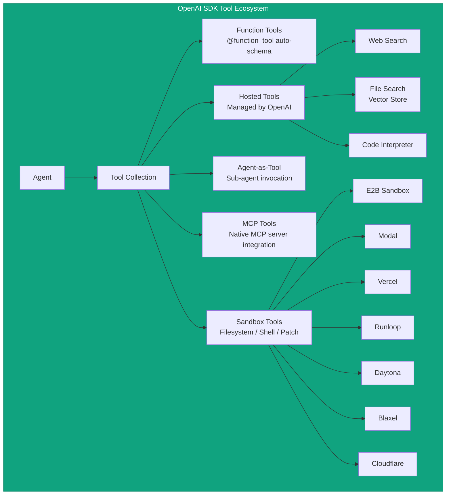

**OpenAI SDK Tool Registration:**
```python
# Function tool via decorator
@function_tool
def search_knowledge_base(query: str, limit: int = 10) -> list[dict]:
    """Search the internal knowledge base."""
    return kb.search(query, limit=limit)

# Hosted tools
from agents.tools import WebSearchTool, FileSearchTool

agent = Agent(
    tools=[
        search_knowledge_base,
        WebSearchTool(),
        FileSearchTool(vector_store_ids=["vs_abc123"]),
    ]
)

# MCP tool integration
from agents import MCPServerStdio

mcp_server = MCPServerStdio(
    params={"command": "npx", "args": ["-y", "@company/enterprise-mcp"]}
)
agent = Agent(tools=[mcp_server])  # MCP tools work identically to function tools
```

### Tool System Comparison

| Feature | MAF | OpenAI SDK |
|---|---|---|
| **Function Tools** | `@function_tool` decorator, auto-schema | `@function_tool` decorator, Pydantic validation |
| **Auto Schema Generation** | Yes | Yes |
| **Type Validation** | Pydantic + type hints | Pydantic TypeAdapter |
| **MCP Integration** | Native MCPClient, GA in v1.0 | Native, same as function tools |
| **Agent-as-Tool** | Via workflow composition | Native first-class primitive |
| **Hosted Tools** | Azure AI Search, Azure Functions | Web Search, File Search, Code Interpreter (OpenAI-managed) |
| **OpenAPI Auto-tools** | Yes (from OpenAPI spec) | Not native |
| **Plugin System** | Semantic Kernel plugin compatibility | No explicit plugin system |
| **Dynamic Tool Discovery** | Yes (via MCP servers) | Yes (via MCP servers) |
| **Sandbox Tools** | Not yet (preview) | GA — filesystem, shell, patch tools |
| **Tool Result Streaming** | Yes | Yes |
| **Parallel Tool Execution** | Yes | Yes |
| **Tool Caching** | CachingChatClient decorator | Not built-in |
| **Microsoft 365 Graph** | Yes (via MCP connector) | No |
| **SharePoint** | Yes (via MCP connector) | No |

---

## 9. Memory & State Management

### MAF Memory Architecture

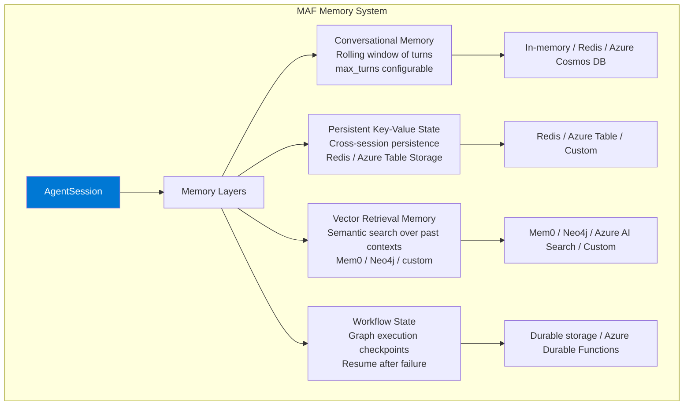

**MAF State Lifecycle:**
- **Within session**: Full conversational history available to all agents in the session
- **Cross-session**: Persistent state backends (Redis, Cosmos DB) allow state to survive process restarts
- **Workflow checkpointing**: Workflow execution state is checkpointed at defined nodes, enabling resume after failure or human review
- **Distributed state**: In distributed multi-agent setups, state synchronization is handled by the runtime via message passing

### OpenAI SDK Memory Architecture

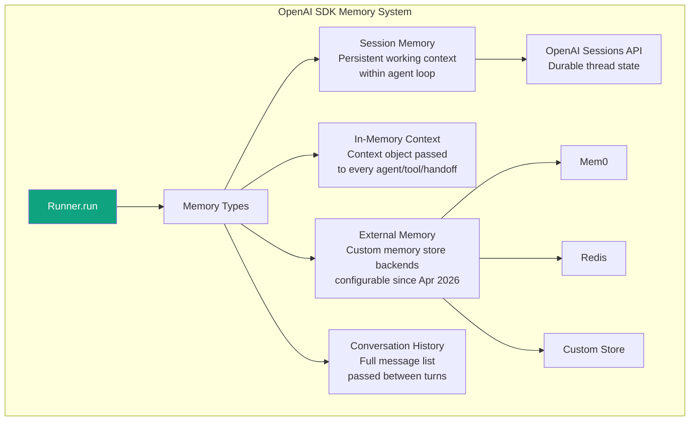

**OpenAI SDK Memory Design:**
```python
from agents import Agent, Runner, Session

# Sessions for persistent working context
session = Session()
result = await Runner.run(
    agent, 
    "What did we discuss last time?",
    session=session  # State persists across runs
)

# Context object for dependency injection
@dataclass
class UserContext:
    user_id: str
    preferences: dict
    conversation_history: list

agent = Agent[UserContext](
    name="assistant",
    tools=[get_user_data]
)

# External memory store (configurable)
from agents.memory import MemoryStore
memory = MemoryStore(backend="mem0", config={...})
```

### State Management Comparison

| Feature | MAF | OpenAI SDK |
|---|---|---|
| **Session Scope** | Agent-session object, configurable backends | Sessions API, configurable since Apr 2026 |
| **Persistent State** | First-class: Redis, Cosmos DB, Azure Table | Configurable external backends |
| **Conversation History** | Automatic with configurable window | Automatic, passed as message list |
| **Cross-Agent State** | Shared via workflow state and session | Context object passed through Runner |
| **Workflow Checkpoints** | Native graph checkpointing at any node | Not applicable (no graph workflows) |
| **Failure Recovery** | Resume from last checkpoint | Re-run from start or custom recovery |
| **Vector Memory** | Native with Mem0, Neo4j, Azure AI Search | Via custom function tools |
| **State Typing** | Type-safe via generics and IMessage | Generic context type parameter |
| **Distributed State** | Event bus + distributed runtime | Same-process; external state required |
| **HITL State Hold** | Workflow pauses and holds state indefinitely | Session-based hold |
| **Cross-Framework State** | Via A2A protocol | Not directly supported |

---

## 10. Communication Patterns & Protocols

### MAF Communication Architecture

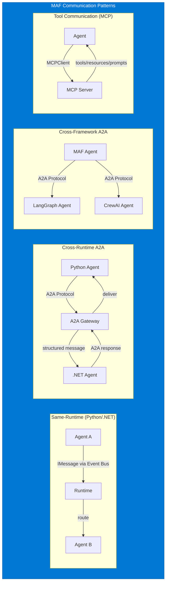

**MAF Communication Protocol Details:**

- **IMessage**: Universal typed message carrier — carries sender/recipient/intent/tool-data metadata
- **Event Bus**: Async, non-blocking message routing within the runtime
- **A2A Protocol**: Structured messaging for cross-runtime/cross-framework agent collaboration
  - Python agent ↔ .NET agent: native support (GA in v1.0, full A2A 1.0 spec coming soon)
  - Supports authentication and explicit call/response semantics
  - Microsoft joined the MCP Steering Committee in May 2025, contributing A2A authorization specs
- **MCP**: Dynamic tool/resource/prompt discovery from MCP-compliant servers
  - Full GA in v1.0
  - Integrated with Azure MCP server at mcp.ai.azure.com

### OpenAI SDK Communication Architecture

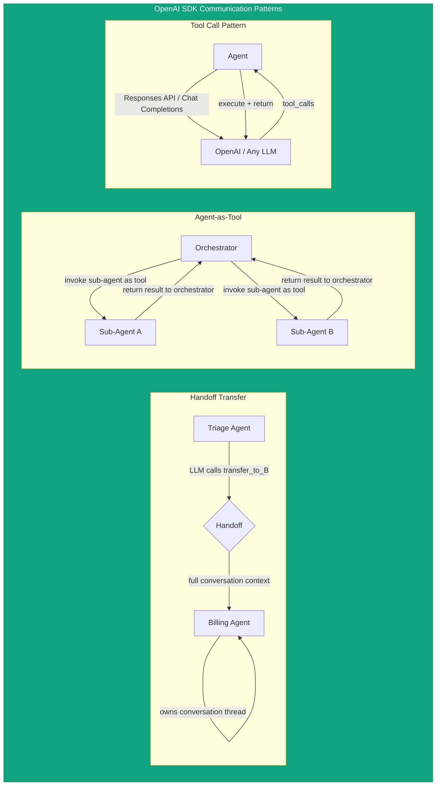

| Communication Aspect | MAF | OpenAI SDK |
|---|---|---|
| **Inter-Agent Message Format** | IMessage (typed, metadata-rich) | Conversation messages (OpenAI format) |
| **Message Routing** | Event bus, explicit workflow edges | LLM decides (handoff as tool call) |
| **Cross-Language** | Python ↔ .NET via A2A | No cross-language (Python or TS only) |
| **Cross-Framework** | A2A protocol | Not supported |
| **Async Messaging** | Yes (event-driven runtime) | Yes (async Python/TS) |
| **Streaming** | Yes | Yes (run_streamed) |
| **Pub/Sub** | Via event bus | No |
| **Message History Filtering** | Via input_filter on handoffs | Via `input_filter` on handoff() |
| **Protocol Standard** | MCP (GA) + A2A (preview → GA) | MCP + AGENTS.md |
| **Cross-Cloud** | Yes (Azure, any cloud via A2A) | No native cross-cloud agent communication |

---

## 11. Guardrails, Safety & Content Filtering

### MAF Safety Architecture

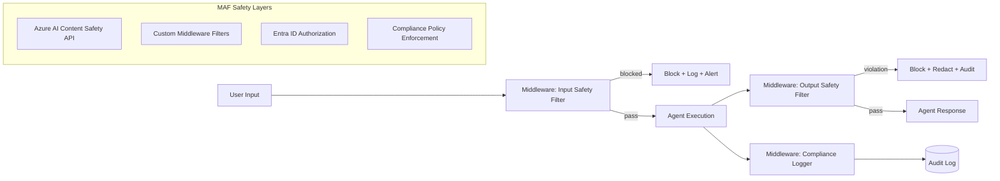

**MAF Safety Features:**
- **Middleware-based filtering**: Content safety logic lives in the middleware pipeline — agents are unmodified
- **Azure AI Content Safety integration**: First-party integration with Microsoft's content moderation API
- **Compliance policies**: Enforce regulatory requirements (GDPR, HIPAA, FINRA) via middleware without touching prompts
- **Audit logging**: Complete audit trail of every agent action, tool call, and decision
- **Entra ID authorization**: Fine-grained access control determining which agents can use which tools or data
- **Content filtering**: Configurable at the model client level (Azure OpenAI content filtering)

### OpenAI SDK Guardrails Architecture

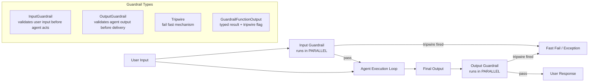

**OpenAI SDK Guardrail Implementation:**
```python
from agents import Agent, GuardrailFunctionOutput, InputGuardrail, RunContextWrapper

async def content_safety_guardrail(
    ctx: RunContextWrapper, agent: Agent, input: str
) -> GuardrailFunctionOutput:
    # Run content classification
    is_safe = await classify_content(input)
    return GuardrailFunctionOutput(
        output_info={"classification": "safe" if is_safe else "harmful"},
        tripwire_triggered=not is_safe
    )

agent = Agent(
    name="assistant",
    instructions="...",
    input_guardrails=[InputGuardrail(guardrail_function=content_safety_guardrail)],
)
```

### Safety Comparison

| Safety Feature | MAF | OpenAI SDK |
|---|---|---|
| **Input Validation** | Middleware pipeline | InputGuardrail (parallel) |
| **Output Validation** | Middleware pipeline | OutputGuardrail (parallel) |
| **Execution Architecture** | Sequential middleware chain | Parallel to agent execution |
| **Fast-Fail** | Middleware short-circuits | Tripwire mechanism |
| **Azure AI Content Safety** | First-party native integration | Custom via function tool |
| **Audit Logging** | Built-in middleware | Via RunHooks |
| **Compliance Policies** | First-class middleware type | Custom guardrail functions |
| **PII Detection** | Azure Presidio integration | Custom implementation |
| **Model-Level Filtering** | Azure OpenAI content filters | OpenAI moderation API |
| **Constitutional AI** | No (by design) | Implicit in OpenAI models |
| **Prompt Injection Defense** | Middleware layer | Custom guardrails |

---

## 12. Observability, Tracing & Monitoring

### MAF Observability Stack

```mermaid
graph LR

    subgraph MAF_OBS["MAF Observability"]

        AG_MAF["Agent Execution"] --> OT["OpenTelemetry SDK"]

        OT --> SPANS["Traces & Spans"]

        SPANS --> AZ_MON["Azure Monitor<br/>Application Insights"]
        SPANS --> PROM["Prometheus"]
        SPANS --> JAEGER["Jaeger"]
        SPANS --> CUSTOM["Custom Exporters"]

        AG_MAF --> DEVUI["DevUI<br/>Browser-based local debugger"]

        DEVUI --> VIZ["Visual agent execution<br/>message flows / tool calls<br/>orchestration decisions"]

        AG_MAF --> AUDIT_LOG["Audit Log<br/>Every action recorded"]

        AUDIT_LOG --> AZ_LOG["Azure Log Analytics"]

    end

    style MAF_OBS fill:#0078d4,color:#fff,stroke:#005a9e
```

**MAF Observability Features:**
- **OpenTelemetry-native**: All agent activity emits OTEL traces — zero configuration required
- **Azure Monitor integration**: Direct connection to Application Insights, Log Analytics
- **DevUI (Preview)**: Browser-based local debugger launched with v1.0 — visualizes agent execution, message flows, tool calls, and orchestration decisions in real time
- **Audit logging middleware**: Every agent action, decision, and tool call is logged for compliance
- **Metrics**: Token usage, latency, error rates automatically instrumented
- **Distributed tracing**: Cross-agent, cross-runtime traces correlated via trace context propagation

### OpenAI SDK Observability Stack

```mermaid
graph LR

    subgraph OAI_OBS["OpenAI SDK Observability"]

        AG_OAI["Agent Execution"]
            --> AUTO_TRACE["Automatic Trace Generation<br/>Zero configuration"]

        AUTO_TRACE --> SPANS_OAI["Trace with Spans"]

        SPANS_OAI --> OAI_DASH["OpenAI Platform Dashboard<br/>Visualize / Debug / Monitor"]

        SPANS_OAI --> CUSTOM_PROC["Custom Trace Processors<br/>Export to any backend"]

        CUSTOM_PROC --> EXT1["LangSmith"]
        CUSTOM_PROC --> EXT2["Arize Phoenix"]
        CUSTOM_PROC --> EXT3["Custom OTEL"]

        subgraph SPAN_TYPES["Span Types Captured"]
            SP1["LLM calls with prompts/completions"]
            SP2["Tool invocations with inputs/outputs"]
            SP3["Handoffs between agents"]
            SP4["Guardrail checks and results"]
            SP5["Session state changes"]
        end

    end

    style OAI_OBS fill:#10a37f,color:#fff,stroke:#0d8a6b
```

**OpenAI SDK Trace Example:**
```python
# Automatic tracing - zero configuration
result = await Runner.run(agent, "Process this request")
# Trace auto-generated at https://platform.openai.com/traces

# Custom trace processor
from agents.tracing import TracingProcessor

class DatadogProcessor(TracingProcessor):
    def on_trace_start(self, trace): ...
    def on_span_end(self, span): 
        datadog.send(span.to_dict())

set_trace_processors([DatadogProcessor()])
```

### Observability Comparison

| Feature | MAF | OpenAI SDK |
|---|---|---|
| **Auto Instrumentation** | Yes (OpenTelemetry) | Yes (custom trace system) |
| **Standard Protocol** | OpenTelemetry (industry standard) | Custom trace system + OTEL export |
| **Visual Debugger** | DevUI (browser-based, preview) | OpenAI Platform Dashboard |
| **Local Debugging** | DevUI (zero cloud dependency) | OpenAI platform (cloud) |
| **Custom Backends** | Any OTEL-compatible exporter | Custom TracingProcessor |
| **Azure Monitor** | Native first-party | Via custom processor |
| **Evaluation** | Azure AI Evaluation (separate service) | Built-in on OpenAI platform |
| **Fine-tuning Integration** | Via Azure AI Foundry | Via OpenAI platform |
| **Distillation** | Not native | Via OpenAI platform |
| **Metrics Granularity** | Token, latency, error, agent-level | Span-level, trace-level |
| **Cross-Agent Correlation** | Via OTEL trace context | Via run trace ID |
| **Audit Trail** | Compliance-grade audit middleware | Trace records (not audit-grade by default) |

---

## 13. Model Support & Provider Ecosystem

### MAF Model Provider Support

```mermaid
graph TB

    subgraph MAF_MODELS["MAF Multi-Provider Model Support"]

        AG_M["Agent"] --> MC["ModelClient Abstraction"]

        MC --> MS_FOUNDRY["Microsoft Foundry<br/>First-party, Azure-native"]
        MC --> AZ_OAI["Azure OpenAI<br/>GPT-5.x / o4-mini / etc"]
        MC --> OAI["OpenAI<br/>Direct API"]
        MC --> ANTHROPIC["Anthropic Claude<br/>Claude 4.x models"]
        MC --> BEDROCK["Amazon Bedrock<br/>Claude / Titan / etc"]
        MC --> GEMINI["Google Gemini<br/>Gemini 2.x models"]
        MC --> OLLAMA["Ollama<br/>Local models: Llama / Mistral / etc"]
        MC --> CUSTOM["Custom ModelClient<br/>Any Chat Completions API"]

        MS_FOUNDRY --> EMBED["Embedding Models"]
        AZ_OAI --> CHAT_COMP["Chat Completions"]
        AZ_OAI --> RESP_API["Responses API"]

    end

    style MAF_MODELS fill:#0078d4,color:#fff,stroke:#005a9e
```

### OpenAI SDK Model Provider Support

```mermaid
graph TB

    subgraph OAI_PROVIDERS["OpenAI SDK Provider Support"]

        AG_O["Agent"] --> MODEL_PARAM["model parameter"]

        MODEL_PARAM --> OAI_NATIVE["OpenAI Models<br/>GPT-5.x / o4 / Codex / etc.<br/>Best performance - Responses API"]
        MODEL_PARAM --> COMPAT["100+ Compatible LLMs<br/>via Chat Completions API"]

        COMPAT --> ANTHROPIC_O["Anthropic Claude<br/>via API endpoint"]
        COMPAT --> GEMINI_O["Google Gemini<br/>via API endpoint"]
        COMPAT --> LOCAL["Local Models<br/>Ollama / LM Studio"]
        COMPAT --> AZURE_O["Azure OpenAI<br/>via Azure endpoint"]
        COMPAT --> BEDROCK_O["Amazon Bedrock<br/>via compatible endpoint"]
        COMPAT --> GROQ["Groq<br/>Fast inference"]
        COMPAT --> TOGETHER["Together AI"]
        COMPAT --> OPENROUTER["OpenRouter<br/>Any model"]

    end

    style OAI_PROVIDERS fill:#10a37f,color:#fff,stroke:#0d8a6b
```

### Model Support Comparison

| Feature | MAF | OpenAI SDK |
|---|---|---|
| **Primary Optimization** | Microsoft Foundry / Azure OpenAI | OpenAI GPT-5.x models |
| **First-Party Support** | MS Foundry, Azure OpenAI | OpenAI |
| **Anthropic Claude** | Yes (first-party connector) | Yes (via Chat Completions compat) |
| **Amazon Bedrock** | Yes (first-party connector) | Yes (via compat endpoint) |
| **Google Gemini** | Yes (first-party connector) | Yes (via compat endpoint) |
| **Local Models (Ollama)** | Yes | Yes |
| **Embedding Models** | Yes (built-in) | No (separate API) |
| **Per-Agent Model** | Yes | Yes |
| **Model Switching** | Via ModelClient swap | Via model parameter |
| **Responses API** | Yes | Yes (default for OpenAI) |
| **Structured Output** | Yes | Yes (Pydantic output_type) |
| **Streaming** | Yes | Yes |
| **Vision/Multimodal** | Yes | Yes |
| **Number of Providers** | 6+ first-party + custom | 100+ via Chat Completions compat |
| **Token Counting** | Yes (shared usage tracking) | Yes (shared run usage) |

---

## 14. Human-in-the-Loop (HITL) Capabilities

### MAF HITL Architecture

```mermaid
flowchart TD
    subgraph "MAF Human-in-the-Loop"
        WF_START([Workflow Start]) --> AGENT1[Agent: Data Collection]
        AGENT1 --> AGENT2[Agent: Analysis]
        AGENT2 --> HITL_GATE{HITL Workflow Node<br/>Pause Execution}
        HITL_GATE -->|workflow pauses| CHECKPOINT[(State Checkpoint<br/>Persisted)]
        CHECKPOINT -->|notification sent| HUMAN[Human Reviewer]
        HUMAN -->|approve + context| RESUME[Resume Workflow]
        HUMAN -->|reject + feedback| REWORK[Rework Node]
        RESUME --> AGENT3[Agent: Report Generation]
        REWORK --> AGENT2
        AGENT3 --> WF_END([Workflow End])
    end
    
    style HITL_GATE fill:#ff9900,color:#000
    style HUMAN fill:#006400,color:#fff
    style CHECKPOINT fill:#0078d4,color:#fff
```

**MAF HITL Features:**
- **Workflow HITL node**: A dedicated workflow node type that pauses graph execution and waits for human input
- **Durable state**: Workflow state is checkpointed when paused — survives process restarts, can wait days/weeks
- **Notification integration**: Can trigger notifications (email, Teams, webhook) when human review is needed
- **Feedback injection**: Human feedback flows back into the workflow as typed inputs to subsequent nodes
- **Audit trail**: Every human intervention is logged with timestamp, reviewer identity, and decision
- **Timeout handling**: Configurable timeouts for HITL nodes with escalation paths

### OpenAI SDK HITL Architecture

```mermaid
flowchart TD
    subgraph "OpenAI SDK HITL"
        RUN[Runner.run] --> INTERRUPT[Interrupt Mechanism]
        INTERRUPT --> TOOL_CALL{Requires human input?}
        TOOL_CALL -->|no| CONTINUE[Continue Execution]
        TOOL_CALL -->|yes| PAUSE[Pause Agent Loop]
        PAUSE --> SESSION_SAVE[Session State Saved]
        SESSION_SAVE --> NOTIFICATION[External Notification<br/>via application logic]
        NOTIFICATION --> HUMAN_O[Human Input]
        HUMAN_O --> RESUME_O[Resume Runner with input]
        RESUME_O --> CONTINUE
        CONTINUE --> RESULT[Final Output]
    end
    
    style PAUSE fill:#ff9900,color:#000
    style HUMAN_O fill:#006400,color:#fff
```

**OpenAI SDK HITL via Sessions:**
```python
# HITL via session persistence + interrupt
from agents import Runner, Agent

async def hitl_workflow(user_input: str, session: Session):
    # First run - may produce something requiring human review
    result = await Runner.run(
        agent,
        user_input,
        session=session
    )
    
    if result.requires_human_review:
        # Send for human review (application logic)
        human_feedback = await notify_human_and_wait(result)
        
        # Resume with human feedback
        final = await Runner.run(
            agent,
            f"Human feedback: {human_feedback}",
            session=session  # State preserved
        )
        return final
    
    return result
```

| HITL Feature | MAF | OpenAI SDK |
|---|---|---|
| **Native HITL Support** | Yes — first-class workflow node type | Yes — built-in interrupt mechanisms |
| **Durable State During Pause** | Yes — workflow checkpoint persists indefinitely | Yes — via Session persistence |
| **Structured Human Input** | Yes — typed workflow node inputs | Via application logic |
| **Notification Integration** | Can integrate (Azure Logic Apps, etc.) | Application-level responsibility |
| **Audit of Human Decisions** | Yes — middleware audit log | Via trace records |
| **Timeout & Escalation** | Configurable per workflow node | Application-level responsibility |
| **Review UI** | DevUI (local) | No built-in review UI |
| **Feedback as Typed Data** | Yes — strongly typed | Via message string |

---

## 15. Workflows & Deterministic Orchestration

This section covers one of the most significant differentiators between the two frameworks.

### MAF Workflow System

MAF introduces **Workflows** as a fundamentally different concept from Agents. While agents use LLM reasoning to decide what to do next, workflows provide **explicit, deterministic, graph-based execution control**.

```mermaid
graph LR
    subgraph "MAF Workflow: Research Pipeline"
        direction TB
        
        N_START([Start]) --> N_INPUT[InputNode<br/>Validate & parse request]
        N_INPUT -->|valid research query| N_SEARCH[ResearchAgent Node<br/>Multi-source search]
        N_INPUT -->|invalid| N_ERROR([Error])
        N_SEARCH --> N_FORK{ForkNode<br/>Parallel Analysis}
        N_FORK --> N_QUANT[QuantAnalyst Node<br/>Quantitative analysis]
        N_FORK --> N_QUAL[QualAnalyst Node<br/>Qualitative analysis]
        N_FORK --> N_RISK[RiskAnalyst Node<br/>Risk assessment]
        N_QUANT --> N_JOIN{JoinNode<br/>Synchronize}
        N_QUAL --> N_JOIN
        N_RISK --> N_JOIN
        N_JOIN --> N_DRAFT[WriterAgent Node<br/>Draft synthesis]
        N_DRAFT --> N_REVIEW[HITL Node<br/>Expert Review]
        N_REVIEW -->|approved| N_PUBLISH[PublisherAgent Node<br/>Format & distribute]
        N_REVIEW -->|revise| N_DRAFT
        N_PUBLISH --> N_CP[(Checkpoint)]
        N_CP --> N_END([End])
    end
    
    style N_REVIEW fill:#ff9900,color:#000
    style N_FORK fill:#6666ff,color:#fff
    style N_JOIN fill:#6666ff,color:#fff
    style N_CP fill:#008000,color:#fff
```

**Workflow Definition (Python):**
```python
from agent_framework.workflows import Workflow, SequentialNode, ConcurrentNode, HITLNode

workflow = Workflow(name="research_pipeline")
workflow.add_node(SequentialNode("input_validation", validator_func))
workflow.add_node(SequentialNode("research", research_agent))
workflow.add_node(ConcurrentNode("analysis", [quant_agent, qual_agent, risk_agent]))
workflow.add_node(HITLNode("expert_review", notify_func=send_to_teams))
workflow.add_node(SequentialNode("publish", publisher_agent))
workflow.add_edge("input_validation", "research", condition=lambda x: x.is_valid)
workflow.add_edge("research", "analysis")
workflow.add_edge("analysis", "expert_review")
workflow.add_edge("expert_review", "publish", condition=lambda x: x.approved)
workflow.add_edge("expert_review", "research", condition=lambda x: not x.approved)
workflow.set_checkpoint_nodes(["analysis", "publish"])
```

**Key Workflow Capabilities:**
- **Type-safe routing**: Edges carry typed data; routing conditions are type-checked
- **Checkpointing**: Save state at any node; resume from checkpoint after failure
- **Concurrent nodes**: Multiple agents execute in parallel; join synchronizes results
- **HITL nodes**: Workflow pauses for human input with durable state
- **Conditional edges**: Business-logic routing without LLM decisions
- **Nested workflows**: Workflows can contain other workflows as sub-graphs
- **Error handling**: Dedicated error nodes and retry logic in the graph

### OpenAI SDK: No Native Workflow System

The OpenAI Agents SDK does **not** have a workflow system in the MAF sense. Orchestration is exclusively through:
1. **Handoffs** — LLM-driven agent transfers
2. **Agent-as-tool** — hierarchical sub-agent invocation
3. **Custom Python/TS logic** — developers write their own orchestration loops

```python
# OpenAI SDK: Custom orchestration via Python logic
async def research_pipeline(query: str) -> str:
    # Sequential orchestration via application code
    research_result = await Runner.run(research_agent, query)
    
    # Parallel via asyncio
    quant, qual, risk = await asyncio.gather(
        Runner.run(quant_agent, research_result.final_output),
        Runner.run(qual_agent, research_result.final_output),
        Runner.run(risk_agent, research_result.final_output),
    )
    
    # HITL via application logic
    if needs_review(quant, qual, risk):
        approval = await human_review_portal(quant, qual, risk)
        if not approval.approved:
            return await research_pipeline(query + "\n" + approval.feedback)
    
    return await Runner.run(publisher_agent, [quant, qual, risk])
```

| Workflow Feature | MAF | OpenAI SDK |
|---|---|---|
| **Graph-Based Workflows** | Yes — native, first-class | No — custom Python/TS logic |
| **Declarative Workflow Definition** | Yes (code + YAML) | No |
| **Checkpointing** | Yes — native at any node | Application responsibility |
| **Failure Recovery** | Resume from checkpoint | Re-run from start |
| **Conditional Routing** | Type-safe graph edges | Python conditionals |
| **Parallel Execution** | Native concurrent nodes | asyncio.gather |
| **HITL as Workflow Node** | Yes — dedicated node type | Application-level construct |
| **Workflow Visualization** | DevUI (preview) | Custom |
| **Nested Workflows** | Yes | N/A |
| **Workflow Versioning** | YAML-based; git-trackable | Code-based |

---

## 16. Sandbox & Execution Environments

### OpenAI SDK Sandbox (GA — April 2026)

OpenAI's April 2026 update added native sandbox support as a core SDK capability — this is currently ahead of MAF's offering.

```mermaid
graph TB

    subgraph OAI_SANDBOX["OpenAI SDK Sandbox Architecture"]

        AG_SB["Sandbox Agent"] --> MANIFEST["Manifest<br/>Defines workspace: files, dependencies, tools"]
        MANIFEST --> SANDBOX["Sandbox Environment"]

        SANDBOX --> E2B_SB["E2B"]
        SANDBOX --> MODAL_SB["Modal"]
        SANDBOX --> VERCEL_SB["Vercel"]
        SANDBOX --> RUNLOOP_SB["Runloop"]
        SANDBOX --> DAYTONA_SB["Daytona"]
        SANDBOX --> BLAXEL_SB["Blaxel"]
        SANDBOX --> CF_SB["Cloudflare"]
        SANDBOX --> CUSTOM_SB["Custom Sandbox<br/>Bring Your Own"]

        SANDBOX --> TOOLS_SB["Sandbox Tools<br/>Filesystem read/write<br/>Shell execution<br/>Install dependencies<br/>Apply patch<br/>Run code"]

        SANDBOX --> RESUME["Resumable Sessions<br/>Long-running sandbox state"]

    end

    style OAI_SANDBOX fill:#10a37f,color:#fff,stroke:#0d8a6b
```

**Sandbox Use Cases:**
```python
from agents import Agent, SandboxAgent, Manifest

manifest = Manifest(
    files={"data.csv": "./data.csv", "analysis.py": "./analysis.py"},
    dependencies=["pandas", "matplotlib", "scikit-learn"],
    env_vars={"API_KEY": os.environ["API_KEY"]}
)

agent = SandboxAgent(
    name="data_analyst",
    instructions="Analyze the data.csv file and produce visualizations.",
    sandbox_provider="e2b",
    manifest=manifest
)

result = await Runner.run(agent, "Find the top 3 revenue trends")
```

### MAF Sandbox Status

MAF does not yet have native sandbox execution in v1.0 GA. Container-based deployment is the nearest equivalent:
- Agents can be deployed as Docker containers (Azure Container Apps, AKS)
- Tool execution happens in the container environment
- Isolation is achieved at the container level, not the per-agent sandbox level
- Preview features are expected in upcoming releases

| Sandbox Feature | MAF | OpenAI SDK |
|---|---|---|
| **Native Sandbox** | Not yet (preview roadmap) | Yes — GA (April 2026) |
| **Sandbox Providers** | Container-level isolation | E2B, Modal, Vercel, Runloop, Daytona, Blaxel, Cloudflare |
| **Filesystem Tools** | Via custom tools | Native (read, write, list, patch) |
| **Shell Execution** | Via custom tools | Native (bash, shell) |
| **Code Execution** | Via Code Interpreter (Azure) | Native sandbox + Code Interpreter |
| **Resumable Sessions** | Yes (workflow checkpoints) | Yes (sandbox sessions) |
| **Dependency Installation** | Container-level | Native (pip, npm in sandbox) |
| **Custom Sandbox** | Via container | Yes (BYOS) |
| **Manifest Abstraction** | Via YAML workflow | Native Manifest object |

---

## 17. Language Support & SDK Surface

### Language Support Comparison

```mermaid
graph TB
    subgraph "Language & Platform Support"
        subgraph "Microsoft Agent Framework"
            MAF_PY[Python 3.10+]
            MAF_NET[.NET 9+<br/>C# first-class]
            MAF_JAVA[Java<br/>Coming Soon]
            MAF_JS[JavaScript/Node.js<br/>Coming Soon]
        end
        
        subgraph "OpenAI Agents SDK"
            OAI_PY_O[Python 3.10+<br/>Full GA feature set]
            OAI_TS[TypeScript / JavaScript<br/>openai-agents-js<br/>Parity with Python]
        end
    end
    
    style MAF_PY fill:#0078d4,color:#fff
    style MAF_NET fill:#0078d4,color:#fff
    style OAI_PY_O fill:#10a37f,color:#fff
    style OAI_TS fill:#10a37f,color:#fff
```

### SDK Surface Area Comparison

| SDK Aspect | MAF | OpenAI SDK |
|---|---|---|
| **Primary Language** | Python + .NET (equal priority) | Python (TypeScript parity) |
| **Python Support** | Full GA | Full GA |
| **.NET / C#** | Full GA — first-class | No |
| **TypeScript** | Planned | Full GA |
| **Java** | Coming soon | No |
| **JavaScript (Node.js)** | Coming soon | Yes (via TypeScript SDK) |
| **Package Install (Python)** | `pip install agent-framework` | `pip install openai-agents` |
| **Package Install (.NET)** | `dotnet add package Microsoft.Agents.AI` | N/A |
| **Package Install (TS)** | TBD | `npm install @openai/agents` |
| **API Stability** | Stable (committed LTS in v1.0) | Evolving (but production-ready) |
| **Async Support** | Yes (asyncio / Task) | Yes (asyncio / Promise) |
| **Sync Support** | Yes | Yes (Runner.run_sync) |
| **Streaming** | Yes | Yes (Runner.run_streamed) |
| **Type Safety** | High (.NET generics, Pydantic) | High (Pydantic, TypeScript types) |

---

## 18. Deployment, Scaling & Infrastructure

### MAF Deployment Architecture

```mermaid
graph TB
    subgraph "MAF Deployment Options"
        subgraph "Azure-Native"
            ACA[Azure Container Apps<br/>Serverless, auto-scale]
            AKS[Azure Kubernetes Service<br/>Full cluster control]
            AZF[Azure Functions<br/>Event-driven agents]
            AF_SVC[Azure AI Foundry Agent Service<br/>Managed hosted agents]
        end
        
        subgraph "Container-Based (Any Cloud)"
            DOCKER[Docker Container]
            K8S[Kubernetes<br/>Any provider]
            HYBRID[On-Premises K8s]
        end
        
        subgraph "Development"
            LOCAL[Local Process<br/>pip install + run]
            DEV_UI[DevUI<br/>Local visual debugger]
        end
        
        subgraph "Integration Targets"
            M365[Microsoft 365 Agents SDK<br/>Teams / Copilot]
            COPILOT[GitHub Copilot / Azure Copilot]
            DEVOPS[Azure DevOps / GitHub Actions<br/>CI/CD]
        end
    end
    
    style ACA fill:#0078d4,color:#fff
    style AKS fill:#0078d4,color:#fff
    style AF_SVC fill:#0078d4,color:#fff
```

**MAF Scaling Characteristics:**
- **Distributed runtime**: Event-driven architecture enables horizontal scaling across nodes
- **Stateless agents**: Agent instances are stateless (state in Session backend); scale independently
- **Container portability**: Run anywhere containers run — Azure, AWS, GCP, on-premises
- **Azure AI Foundry Agent Service**: Fully managed hosted agent service — zero infrastructure management
- **Cross-runtime**: A2A protocol allows agent fleets to span Python and .NET runtimes

### OpenAI SDK Deployment Architecture

```mermaid
graph TB
    subgraph "OpenAI SDK Deployment Options"
        subgraph "Serverless Platforms"
            VERCEL_D[Vercel<br/>Edge deployment]
            MODAL_D[Modal<br/>GPU-enabled serverless]
            CF_D[Cloudflare Workers<br/>Edge agents]
        end
        
        subgraph "Container / Cloud"
            DOCKER_O[Docker Container]
            AWS[AWS Lambda / Fargate]
            GCP[Google Cloud Run]
            AZURE_O[Azure Container Apps]
        end
        
        subgraph "Development"
            LOCAL_O[Local Process]
        end
        
        subgraph "Sandbox Providers"
            E2B_D[E2B<br/>Remote sandbox]
            DAYTONA_D[Daytona<br/>Dev environment]
            RUNLOOP_D[Runloop]
        end
    end
    
    style VERCEL_D fill:#10a37f,color:#fff
    style MODAL_D fill:#10a37f,color:#fff
```

| Deployment Feature | MAF | OpenAI SDK |
|---|---|---|
| **Azure-Native Managed** | Azure AI Foundry Agent Service | OpenAI Assistants API (separate product) |
| **Kubernetes** | First-class support + docs | Self-managed |
| **Serverless** | Azure Functions, Azure Container Apps | Vercel, Modal, Cloudflare (via sandbox) |
| **Container Support** | Full (Docker, AKS, ACA) | Full (any container runtime) |
| **CI/CD Integration** | GitHub Actions + Azure DevOps templates | Self-managed |
| **Horizontal Scaling** | Yes (distributed event-driven runtime) | Via application architecture |
| **Multi-Cloud** | Yes (A2A protocol spans clouds) | Yes (cloud-agnostic Python/TS) |
| **On-Premises** | Yes (any K8s, including AMD GPU servers) | Yes (self-hosted) |
| **Edge Deployment** | Limited | Yes (Cloudflare Workers, Vercel Edge) |
| **Resource Requirements** | Higher (enterprise runtime) | Lower (minimal library) |

---

## 19. Security, Authentication & Governance

### MAF Security Architecture

```mermaid
graph TB

    subgraph SEC["MAF Enterprise Security"]

        AGENT_SEC["Agent Execution"] --> AUTH_LAYER["Authentication Layer"]

        AUTH_LAYER --> ENTRA["Microsoft Entra ID<br/>OAuth 2.0 / OIDC"]
        AUTH_LAYER --> AKV["Azure Key Vault<br/>Secret management"]
        AUTH_LAYER --> MANAGED["Managed Identity<br/>Zero-secret deployments"]

        AGENT_SEC --> AUTHZ["Authorization"]

        AUTHZ --> RBAC["Role-Based Access Control<br/>Which agents access which tools/data"]
        AUTHZ --> POLICY["Policy Enforcement<br/>Compliance rules via middleware"]

        AGENT_SEC --> AUDIT_SEC["Compliance & Audit"]

        AUDIT_SEC --> AUDIT_TRAIL["Immutable Audit Trail<br/>Every action logged"]
        AUDIT_SEC --> SOC2["SOC 2 Compliance<br/>via Azure platform"]
        AUDIT_SEC --> GDPR["GDPR / HIPAA / FINRA<br/>Compliance middleware"]

        AGENT_SEC --> NET_SEC["Network Security"]

        NET_SEC --> VPN["Azure VNet Integration"]
        NET_SEC --> PEP["Private Endpoints"]
        NET_SEC --> FIREWALL["Azure Firewall"]

    end
```

### OpenAI SDK Security

```mermaid
graph TB

    subgraph OAI_SEC["OpenAI SDK Security Model"]

        SDK_SEC["SDK Layer"] --> API_KEY["API Key / Bearer Token<br/>Environment variable"]
        SDK_SEC --> CUSTOM_AUTH["Custom Auth<br/>Application responsibility"]

        SDK_SEC --> GUARD_SEC["Guardrails as Security"]
        GUARD_SEC --> INPUT_SEC["Input Validation<br/>Custom guardrails"]
        GUARD_SEC --> OUTPUT_SEC["Output Filtering<br/>Custom guardrails"]

        SDK_SEC --> MODEL_SEC["Model-Level Safety"]
        MODEL_SEC --> OAI_SAFETY["OpenAI Safety Systems<br/>Built into model"]
        MODEL_SEC --> MOD_API["Moderation API<br/>Via hosted tools"]

        SDK_SEC --> TRACE_SEC["Trace Security"]
        TRACE_SEC --> DATA_RET["Data Retention<br/>Business data not used for training"]

    end

    style OAI_SEC fill:#10a37f,color:#fff,stroke:#0d8a6b
```

| Security Feature | MAF | OpenAI SDK |
|---|---|---|
| **Authentication** | Microsoft Entra ID (enterprise SSO) | API Key / custom |
| **Secret Management** | Azure Key Vault integration | Environment variables / custom |
| **Managed Identity** | Yes — zero-secret deployments | No |
| **RBAC** | Yes — Entra ID roles for agents | Application responsibility |
| **Audit Trail** | Compliance-grade middleware | Trace records (not compliance-grade) |
| **Network Isolation** | Azure VNet, Private Endpoints | TLS only |
| **Data Residency** | Azure regions, EU/US compliance | OpenAI data processing regions |
| **SOC 2** | Azure platform compliance | OpenAI platform compliance |
| **HIPAA** | Configurable via Azure health data | Not natively (OpenAI enterprise tier) |
| **GDPR** | Compliance middleware + EU regions | Via OpenAI enterprise agreement |
| **PII Protection** | Azure Presidio integration | Custom guardrails |
| **Content Filtering** | Azure AI Content Safety (first-party) | OpenAI moderation API |
| **Compliance Policies** | First-class middleware type | Custom guardrail functions |
| **Zero-Trust Architecture** | Yes (Entra + managed identity) | Partial (API key based) |

---

## 20. Developer Experience & Tooling

### MAF Developer Experience

```mermaid
graph LR
    subgraph "MAF Developer Journey"
        INSTALL[pip install agent-framework<br/>dotnet add package Microsoft.Agents.AI] 
        --> FIRST_AGENT[First Agent<br/>~5-10 lines of code]
        --> TOOLS[Add Tools<br/>@function_tool]
        --> MULTI[Multi-Agent<br/>Workflow or Orchestration]
        --> ENTERPRISE[Enterprise Features<br/>Middleware / Auth / Telemetry]
        --> PROD[Production Deploy<br/>Azure / Container]
    end
    
    subgraph "MAF Tooling"
        DEVUI_T[DevUI<br/>Browser debugger]
        VSCODE_T[VS Code Extension<br/>AI Foundry integration]
        MIGS[Migration Assistants<br/>AutoGen → MAF<br/>SK → MAF]
        YAML_T[YAML Agent Definitions<br/>Version-controlled]
        CICD_T[GitHub Actions Templates<br/>Azure DevOps]
    end
```

**MAF Learning Curve:**
- Higher initial complexity due to enterprise concepts (sessions, middleware, workflows)
- Excellent documentation on Microsoft Learn with migration guides
- Two SDKs to learn if using both Python and .NET features
- YAML declarative agents reduce code complexity for simple scenarios
- DevUI significantly reduces debugging time for complex multi-agent workflows

### OpenAI SDK Developer Experience

```mermaid
graph LR
    subgraph "OpenAI SDK Developer Journey"
        INSTALL_O[pip install openai-agents<br/>npm install @openai/agents]
        --> FIRST_O[First Agent<br/>~3-5 lines]
        --> TOOLS_O[Add Tools<br/>@function_tool]
        --> MULTI_O[Multi-Agent<br/>Handoffs]
        --> GUARDRAILS_O[Add Safety<br/>Guardrails]
        --> PROD_O[Deploy<br/>Any platform]
    end
    
    subgraph "OpenAI SDK Tooling"
        DASH[OpenAI Platform Dashboard<br/>Trace visualization]
        AGENTS_MD[AGENTS.md spec<br/>Agent documentation standard]
        AGENTKIT[AgentKit<br/>Higher-level tooling]
        AGENT_BUILDER[Agent Builder<br/>Visual agent configuration]
        EVAL[Evaluation Platform<br/>OpenAI platform]
    end
```

**OpenAI SDK Learning Curve:**
- Very low barrier — complete feature set learnable in an afternoon
- Excellent documentation at openai.github.io/openai-agents-python
- 19,000+ GitHub stars indicate strong community adoption
- Dual-language (Python + TypeScript) with documented parity
- Platform dashboard provides excellent debugging/monitoring for most use cases

### Developer Experience Comparison

| DX Feature | MAF | OpenAI SDK |
|---|---|---|
| **Time to First Agent** | ~15-30 min (more concepts) | ~5-10 min (minimal primitives) |
| **Learning Curve** | Medium-High | Low |
| **Documentation Quality** | Excellent (Microsoft Learn) | Excellent (openai.github.io) |
| **Visual Debugger** | DevUI (local, browser-based) | OpenAI platform dashboard |
| **Migration Tools** | AutoGen → MAF, SK → MAF assistants | No migration tools needed (new SDK) |
| **Declarative Config** | YAML + code | Code only |
| **IDE Support** | Full (.NET + Python tooling) | Full (Python + TypeScript) |
| **GitHub Stars (est.)** | Growing (launched Oct 2025) | 19,000+ (Python SDK) |
| **Error Messages** | Enterprise-grade with context | Clean and actionable |
| **Boilerplate** | Moderate | Very low |
| **Testing Utilities** | Built-in (AgentSession mocking) | Custom + tracing |
| **Community Size** | Enterprise-focused, growing | Large, rapid adoption |

---

## 21. Voice & Multimodal Capabilities

### OpenAI SDK Voice Agents

OpenAI Agents SDK has native voice support via the Realtime API:

```python
from agents.voice import VoiceAgent, RealtimeSession

voice_agent = VoiceAgent(
    name="voice_assistant",
    instructions="You are a helpful voice assistant.",
    model="gpt-4o-realtime",
    tools=[search_knowledge_base],
    handoffs=[billing_agent, support_agent]  # Same handoff patterns work!
)

async with RealtimeSession(voice_agent) as session:
    await session.start_audio_stream()
```

- **Same handoffs and guardrails** work in voice mode — identical patterns
- **Low-latency streaming** for real-time conversation
- **Tool calls during voice** — agent can search, compute, and look up data while speaking

### MAF Multimodal Support

- **Vision/Image inputs**: Supported via multimodal model clients
- **Document processing**: First-class via Azure AI Document Intelligence integration
- **Audio**: Not natively in MAF core (available via Azure Cognitive Services)
- **Video**: Not natively in MAF core

| Multimodal Feature | MAF | OpenAI SDK |
|---|---|---|
| **Voice Agents** | Not native (Azure Speech separately) | Yes — Realtime API integration |
| **Image/Vision** | Yes (multimodal model clients) | Yes |
| **Document Processing** | Yes (Azure AI Document Intelligence) | Yes (file search + document tools) |
| **Code Execution** | Via container tools | Yes (sandbox + code interpreter) |
| **Audio Analysis** | Via Azure Cognitive Services | Via Whisper / Realtime API |
| **Video** | Via Azure Video Indexer | Limited |

---

## 22. Enterprise Readiness

```mermaid
xychart-beta
    title Enterprise Readiness Scores

    x-axis ["Audit","Security","Scalability","Observability","Support","Governance","MS Integration","Dev UX","Community","Speed"]
    y-axis "Score" 0 --> 10

    bar "Microsoft Agent Framework" [9,9,8,8,9,9,10,7,6,6]
    bar "OpenAI Agents SDK" [5,6,7,7,7,5,4,9,9,9]
```

*(Note: Radar chart representation — higher = better for each dimension)*

### MAF Enterprise Features Matrix

| Enterprise Requirement | MAF Capability | Maturity |
|---|---|---|
| **SOC 2 / ISO 27001** | Via Azure platform | Production |
| **HIPAA** | Azure Health Data Services + compliance middleware | Production |
| **GDPR / EU Data Residency** | Azure EU regions + compliance policies | Production |
| **FINRA** | Audit middleware + immutable logging | Production |
| **Entra ID SSO** | Native first-party | Production |
| **Managed Identity (no secrets)** | Yes | Production |
| **Private Network Deployment** | VNet, Private Endpoints | Production |
| **Role-Based Access Control** | Entra + Azure RBAC | Production |
| **Immutable Audit Log** | Compliance middleware | Production |
| **OpenTelemetry / SIEM Integration** | Native OTEL → any SIEM | Production |
| **CI/CD Pipelines** | GitHub Actions + Azure DevOps templates | Production |
| **Long-Term Support (LTS)** | Committed in v1.0 | Production |
| **SLA Support** | Via Microsoft Premier Support | Enterprise |
| **24/7 Support** | Microsoft Customer Success | Enterprise |

---

## 23. Open Standards & Interoperability

### Protocol Support Overview

```mermaid
graph TB

    subgraph OS["Open Standards Support"]

        subgraph MCP["Model Context Protocol (MCP)"]
            MCP_MAF["MAF: MCPClient<br/>GA in v1.0<br/>Dynamic tool discovery<br/>MCP Steering Committee member"]
            MCP_OAI["OpenAI SDK: MCPServer<br/>Native integration<br/>Same as function tools"]
        end

        subgraph A2A["Agent-to-Agent (A2A)"]
            A2A_MAF["MAF: A2A Protocol<br/>Cross-runtime: Python ↔ .NET<br/>Cross-framework: MAF ↔ LangGraph<br/>A2A 1.0 full spec: coming soon"]
            A2A_OAI["OpenAI SDK: No native A2A<br/>Agent-as-tool is same-runtime only"]
        end

        subgraph OPENAPI["OpenAPI"]
            OA_MAF["MAF: OpenAPI tool auto-generation<br/>Connect any REST API as agent tool"]
            OA_OAI["OpenAI SDK: Manual wrapping required"]
        end

        subgraph AGENTSMD["AGENTS.md"]
            AGENTS_OAI["OpenAI SDK: AGENTS.md support<br/>Agent documentation standard"]
            AGENTS_MAF["MAF: YAML declarative definitions<br/>Own documentation standard"]
        end

    end
```

### A2A Protocol Deep Dive (MAF Advantage)

The A2A (Agent-to-Agent) protocol is a significant MAF differentiator:

```mermaid
sequenceDiagram
    participant PY as Python Agent (MAF)
    participant A2A as A2A Gateway
    participant NET as .NET Agent (MAF)
    participant EXT as External Agent (LangGraph)
    
    PY->>A2A: Send A2A message {intent, context, auth}
    A2A->>NET: Route to .NET agent
    NET->>NET: Process with .NET runtime
    NET->>A2A: A2A response {result, status}
    A2A->>PY: Deliver response
    
    PY->>A2A: Send A2A message to external agent
    A2A->>EXT: Protocol-driven message
    EXT->>A2A: Protocol-driven response
    A2A->>PY: Deliver result
    
    Note over A2A: Authentication, authorization,<br/>structured messaging all<br/>handled by protocol
```

**MCP Integration (Both Frameworks):**
- Both frameworks support MCP as the standard for tool/resource discovery
- MAF joined the MCP Steering Committee, contributing authorization specifications
- Azure AI Foundry hosts the cloud MCP server at `mcp.ai.azure.com` with Entra auth
- Both treat MCP tools identically to function tools from the agent's perspective
- MAF connects to 1400+ business system MCP servers via Azure AI Foundry Tools tab

---

## 24. Performance & Latency Characteristics

### Performance Architecture Comparison

```mermaid
graph LR
    subgraph "MAF Performance Characteristics"
        direction TB
        MAF_COLD[Cold Start: Higher<br/>Enterprise runtime initialization]
        MAF_WARM[Warm Performance: High<br/>Event-driven async dispatch]
        MAF_DIST[Distributed Scale: Excellent<br/>Horizontal scaling via event bus]
        MAF_STATE[State Access: Fast with Redis<br/>Configurable backends]
        MAF_CACHE[Response Caching: CachingChatClient<br/>Built-in LLM response cache]
    end
    
    subgraph "OpenAI SDK Performance Characteristics"
        direction TB
        OAI_COLD[Cold Start: Very Low<br/>Minimal runtime overhead]
        OAI_WARM[Warm Performance: High<br/>Direct LLM call path]
        OAI_PARA[Parallel Tool Execution: Excellent<br/>asyncio-native]
        OAI_STREAM[Streaming: Excellent<br/>run_streamed first-class]
        OAI_GUARD[Guardrails: No overhead<br/>Parallel execution]
    end
```

| Performance Aspect | MAF | OpenAI SDK |
|---|---|---|
| **Cold Start Time** | Higher (enterprise runtime) | Very low (lightweight library) |
| **Per-Request Overhead** | Low after warm-up | Minimal |
| **LLM Response Caching** | Yes (CachingChatClient) | No built-in |
| **Parallel Tool Calls** | Yes | Yes |
| **Streaming Support** | Yes | Yes (first-class) |
| **Distributed Execution** | Yes (event-driven, horizontal scale) | Application-level |
| **In-Process Perf** | Good | Excellent |
| **Memory Footprint** | Larger (full enterprise SDK) | Small (minimal dependencies) |
| **Latency Guardrails** | Sequential middleware | Parallel (no added latency) |
| **Throughput at Scale** | Excellent (distributed runtime) | Dependent on application design |

---

## 25. Pricing, Licensing & Cost Model

### Licensing

| Aspect | MAF | OpenAI SDK |
|---|---|---|
| **License** | MIT License | MIT License |
| **Commercial Use** | Yes, unrestricted | Yes, unrestricted |
| **Source Code** | Open source (github.com/microsoft/agent-framework) | Open source (github.com/openai/openai-agents-python) |
| **Modification** | Permitted | Permitted |
| **Distribution** | Permitted | Permitted |

### Cost Model

```mermaid
graph TB
    subgraph "MAF Cost Components"
        MAF_LLM[LLM API Costs<br/>Per token — Azure OpenAI / OpenAI / etc]
        MAF_INFRA[Infrastructure Costs<br/>Azure Container Apps / AKS<br/>Azure AI Foundry Agent Service]
        MAF_STORE[Storage Costs<br/>Azure Cosmos DB / Redis for state<br/>Azure Monitor for telemetry]
        MAF_MCP[MCP Server Costs<br/>Depends on MCP provider]
        MAF_SUPPORT[Support Costs<br/>Optional Microsoft Premier]
    end
    
    subgraph "OpenAI SDK Cost Components"
        OAI_LLM[LLM API Costs<br/>Per token — OpenAI or other provider]
        OAI_HOSTED[Hosted Tool Costs<br/>Web search / File search / Code Interpreter per use]
        OAI_SANDBOX[Sandbox Costs<br/>E2B / Modal / Vercel per compute hour]
        OAI_TRACE[Tracing Costs<br/>OpenAI platform — included in API]
        OAI_INFRA[Infrastructure<br/>Self-managed or serverless]
    end
```

**Key Cost Considerations:**

*MAF:*
- Framework itself is free (MIT)
- Azure infrastructure costs can be significant for enterprise deployments
- Azure AI Foundry Agent Service offers managed hosting with SLA
- State persistence backends (Redis, Cosmos DB) add ongoing costs
- CachingChatClient can significantly reduce LLM API costs

*OpenAI SDK:*
- Framework itself is free (MIT)
- Hosted tools (Web Search, File Search) charged per use by OpenAI
- Sandbox providers (E2B, Modal, etc.) have their own pricing
- Optimized for OpenAI API — best cost efficiency with OpenAI models
- Can use cheaper providers (Groq, Together AI) for compatible models

---

## 26. Community, Support & Ecosystem

### Ecosystem Comparison

```mermaid
graph TB
    subgraph "MAF Ecosystem"
        MAF_GH[GitHub: microsoft/agent-framework<br/>MIT License, active development]
        MAF_DOCS[Microsoft Learn<br/>Comprehensive docs + tutorials]
        MAF_BLOG[Microsoft Foundry Blog<br/>Regular updates]
        MAF_COMMUNITY[Microsoft Tech Community<br/>Forums + Q&A]
        MAF_PARTNERS[Enterprise Partners<br/>ISVs / System Integrators]
        MAF_CONTRIB[Open Source Contributors<br/>PR + issues welcome]
    end
    
    subgraph "OpenAI SDK Ecosystem"
        OAI_GH[GitHub: openai/openai-agents-python<br/>19,000+ stars]
        OAI_TS_GH[GitHub: openai/openai-agents-js<br/>2,400+ stars]
        OAI_DOCS[openai.github.io docs<br/>Comprehensive reference]
        OAI_AGENTKIT[AgentKit<br/>Higher-level abstractions]
        OAI_COMMUNITY[Developer Community<br/>Large, active]
        OAI_3P[Third-Party Integrations<br/>LangSmith, Arize, Mem0, etc.]
    end
```

| Community Aspect | MAF | OpenAI SDK |
|---|---|---|
| **GitHub Stars** | Growing (launched Oct 2025) | 19,000+ Python, 2,400+ TypeScript |
| **Issue Response Time** | Microsoft team + community | OpenAI team + community |
| **Contributing Guide** | Yes | Yes |
| **Official Support** | Microsoft support channels | OpenAI developer support |
| **Enterprise Support** | Microsoft Premier Support | OpenAI enterprise tier |
| **Third-Party Integrations** | Enterprise tools (Azure, M365) | LangSmith, Arize, Mem0, etc. |
| **Blog / Updates** | Microsoft Foundry Blog | OpenAI Developers Blog |
| **Stack Overflow** | Growing | Very active |
| **Discord / Slack** | Microsoft Developer Discord | Active community Slack |

---

## 27. Migration Paths & Upgrade Stories

### Migration to MAF

```mermaid
flowchart TD
    subgraph "Migration to Microsoft Agent Framework"
        FROM_SK[From Semantic Kernel] --> SK_GUIDE[SK Migration Guide<br/>learn.microsoft.com]
        FROM_AG[From AutoGen] --> AG_GUIDE[AutoGen Migration Guide<br/>github.com/microsoft/autogen]
        FROM_SK --> MIGRATE_ASSIST[Migration Assistant Tool<br/>Analyzes code, generates plan]
        FROM_AG --> MIGRATE_ASSIST
        MIGRATE_ASSIST --> STEP1[Step 1: Inventory existing agents]
        STEP1 --> STEP2[Step 2: Convert to AIAgent/IAgent]
        STEP2 --> STEP3[Step 3: Migrate plugins → function_tool]
        STEP3 --> STEP4[Step 4: Migrate SK memory → ContextProvider]
        STEP4 --> STEP5[Step 5: Set up sessions and workflows]
        STEP5 --> STEP6[Step 6: Configure middleware]
        STEP6 --> PROD_MAF[Production MAF Deployment]
    end
```

**Key AutoGen → MAF Migration Notes:**
- AutoGen `ConversableAgent` → MAF `AIAgent`
- AutoGen `GroupChatManager` → MAF Group Chat orchestration pattern
- AutoGen `register_reply` → MAF middleware pipeline
- AutoGen `UserProxyAgent` → MAF HITL workflow node

**Key Semantic Kernel → MAF Migration Notes:**
- SK `KernelFunction` → MAF `AIFunctionFactory` (package renamed in v1.0)
- SK `Planner` → MAF Workflow engine
- SK `Memory` → MAF `ContextProvider`
- SK `ChatCompletionAgent` → MAF `AIAgent`

---

## 28. Use Case Suitability Matrix

```mermaid
graph TB

    subgraph MAF["Strong MAF Fit"]
        UC1["Enterprise .NET applications<br/>C#, Azure-native stack"]
        UC2["Regulated industries<br/>HIPAA, FINRA, GDPR compliance"]
        UC3["Complex deterministic workflows<br/>Multi-step, checkpointed processes"]
        UC4["Cross-language agent fleets<br/>Python + .NET agents coordinating"]
        UC5["Microsoft 365 integration<br/>Teams, Copilot, SharePoint"]
        UC6["Long-running workflows<br/>Days/weeks execution, HITL gates"]
        UC7["Research-to-production pipelines<br/>AutoGen patterns in enterprise"]
    end

    subgraph OAI["Strong OpenAI SDK Fit"]
        UC8["Rapid prototyping<br/>Ship in hours not days"]
        UC9["Customer support automation<br/>Handoff triage patterns"]
        UC10["Python/TypeScript teams<br/>Not invested in .NET"]
        UC11["Sandbox code execution agents<br/>Filesystem, shell, code"]
        UC12["Voice agents<br/>Realtime API integration"]
        UC13["OpenAI-optimized workloads<br/>GPT-5.x / o4 model performance"]
        UC14["Simple to moderate orchestration<br/>Handoffs sufficient"]
    end

    subgraph BOTH["Both Frameworks Suitable"]
        UC15["Multi-agent research assistants"]
        UC16["Data analysis pipelines"]
        UC17["Content generation workflows"]
        UC18["RAG-based enterprise search"]
        UC19["Customer service automation"]
    end

    style MAF fill:#deecf9,stroke:#0078d4
    style OAI fill:#d4f1e8,stroke:#10a37f
    style BOTH fill:#fff9db,stroke:#f0c000
```

### Detailed Use Case Analysis

| Use Case | Recommended Framework | Reason |
|---|---|---|
| **Enterprise .NET application with AI** | MAF | First-class .NET SDK, Azure integration |
| **Regulated industry compliance** | MAF | Audit middleware, Entra ID, compliance policies |
| **Rapid MVP / prototype** | OpenAI SDK | Minimal boilerplate, fast to learn |
| **Customer support triage** | OpenAI SDK | Handoff pattern is tailor-made |
| **Multi-step research pipeline** | MAF | Graph workflows, checkpointing |
| **Code generation / sandbox execution** | OpenAI SDK | Native sandbox tools |
| **Voice-enabled agent** | OpenAI SDK | Realtime API integration |
| **Cross-framework agent network** | MAF | A2A protocol |
| **Microsoft Teams bot / Copilot** | MAF | M365 Agents SDK integration |
| **Python-only team, OpenAI models** | OpenAI SDK | Optimized for OpenAI, simple Python |
| **Long-running workflow with HITL** | MAF | Durable workflow checkpoints |
| **Local model / privacy-sensitive** | MAF (Ollama) or OpenAI SDK | Both support Ollama; MAF has stronger enterprise controls |
| **Crypto/DeFi agent** | OpenAI SDK | AgentKit integration (Coinbase example) |
| **Azure-native enterprise app** | MAF | Azure Monitor, Entra ID, first-party Azure connectors |
| **Edge deployment** | OpenAI SDK | Cloudflare Workers, Vercel Edge |

---

## 29. Limitations & Known Gaps

### MAF Current Limitations

| Limitation | Detail | Roadmap Status |
|---|---|---|
| **No native sandbox execution** | Container-level isolation only | Preview in future release |
| **No native voice support** | Azure Cognitive Services separately | Not on near-term roadmap |
| **A2A 1.0 full spec** | A2A support is preview; full 1.0 coming soon | Coming in upcoming update |
| **Java / JavaScript SDKs** | Only Python and .NET currently | Coming soon |
| **Higher complexity** | Steeper learning curve than OpenAI SDK | By design (enterprise features) |
| **DevUI is preview** | Browser debugger still in preview | Will reach stable in upcoming releases |
| **Azure-centric documentation** | Examples often assume Azure stack | Non-Azure docs improving |
| **Cold start overhead** | Enterprise runtime takes longer to initialize | Architectural trade-off |

### OpenAI SDK Current Limitations

| Limitation | Detail | Roadmap Status |
|---|---|---|
| **No .NET support** | Python and TypeScript only | No announced plans |
| **No graph-based workflows** | Must write orchestration in application code | Not on roadmap (by design) |
| **No cross-framework A2A** | No structured cross-framework messaging | Not on roadmap |
| **No workflow checkpointing** | Manual state management for recovery | Partial via Sessions |
| **Guardrails limited** | No compliance-grade audit middleware | Application responsibility |
| **No OpenAPI auto-tools** | REST APIs require manual function wrapping | Not announced |
| **Platform dependency for eval** | Best evaluation on OpenAI platform | Can export to external tools |
| **Sandbox Python-only first** | TypeScript sandbox support planned | Coming soon |
| **No .NET ecosystem** | Microsoft stack teams excluded | No plans |
| **Open-ended orchestration only** | Deterministic workflows require custom code | By design philosophy |

---

## 30. Code Examples: Side-by-Side

### Hello World Agent

**MAF (Python):**
```python
from agent_framework import AIAgent
from agent_framework.models import AzureOpenAIClient

agent = AIAgent(
    name="hello_agent",
    instructions="You are a helpful assistant.",
    model=AzureOpenAIClient(model="gpt-5.4-mini")
)

result = await agent.run("What is the largest city in France?")
print(result.output)
```

**OpenAI SDK (Python):**
```python
from agents import Agent, Runner

agent = Agent(
    name="hello_agent",
    instructions="You are a helpful assistant.",
    model="gpt-4.1-mini"
)

result = await Runner.run(agent, "What is the largest city in France?")
print(result.final_output)
```

---

### Multi-Agent Handoff / Orchestration

**MAF (Sequential Workflow):**
```python
from agent_framework import AIAgent
from agent_framework.workflows import Workflow, SequentialNode

triage_agent = AIAgent(
    name="triage",
    instructions="Classify customer inquiry: billing, technical, or general",
    model="gpt-5.4-mini"
)

billing_agent = AIAgent(
    name="billing",
    instructions="Handle billing inquiries with precise account data",
    model="gpt-5.4",
    tools=[lookup_invoice, process_refund]
)

technical_agent = AIAgent(
    name="technical",
    instructions="Resolve technical support issues with KB access",
    model="gpt-5.4",
    tools=[search_knowledge_base, create_ticket]
)

# Define workflow with conditional routing
workflow = Workflow(name="customer_support")
workflow.add_node(SequentialNode("triage", triage_agent))
workflow.add_node(SequentialNode("billing", billing_agent))
workflow.add_node(SequentialNode("technical", technical_agent))
workflow.add_edge("triage", "billing", 
                  condition=lambda r: "billing" in r.output.lower())
workflow.add_edge("triage", "technical", 
                  condition=lambda r: "technical" in r.output.lower())

result = await workflow.run("I was charged twice last month")
```

**OpenAI SDK (Handoffs):**
```python
from agents import Agent, Runner, handoff

billing_agent = Agent(
    name="Billing Agent",
    instructions="Handle billing inquiries with precise account data",
    tools=[lookup_invoice, process_refund]
)

technical_agent = Agent(
    name="Technical Agent",
    instructions="Resolve technical support issues",
    tools=[search_knowledge_base, create_ticket]
)

triage_agent = Agent(
    name="Triage Agent",
    instructions="""Classify and route customer inquiries.
    - For billing issues, hand off to Billing Agent
    - For technical issues, hand off to Technical Agent""",
    handoffs=[billing_agent, handoff(technical_agent, 
              on_handoff=lambda ctx: log_routing_decision(ctx))]
)

result = await Runner.run(triage_agent, "I was charged twice last month")
print(result.final_output)
```

---

### Tool Integration with MCP

**MAF (MCPClient):**
```python
from agent_framework import AIAgent
from agent_framework.mcp import MCPClient

mcp_client = MCPClient(
    server_url="https://enterprise-mcp.company.com/sse",
    auth=EntraIDAuth()
)

agent = AIAgent(
    name="data_agent",
    instructions="Use enterprise tools to answer data questions.",
    tools=[mcp_client]  # All MCP server tools available
)

result = await agent.run("Show Q1 revenue breakdown by region")
```

**OpenAI SDK (MCP):**
```python
from agents import Agent, Runner
from agents.mcp import MCPServerSSE

mcp_server = MCPServerSSE(
    url="https://enterprise-mcp.company.com/sse",
    headers={"Authorization": f"Bearer {token}"}
)

agent = Agent(
    name="data_agent",
    instructions="Use enterprise tools to answer data questions.",
    tools=[mcp_server]  # MCP tools work identically to function tools
)

result = await Runner.run(agent, "Show Q1 revenue breakdown by region")
```

---

### Guardrails / Safety

**MAF (Middleware):**
```python
from agent_framework import AIAgent
from agent_framework.middleware import ContentSafetyMiddleware, ComplianceMiddleware

class PIIFilterMiddleware(AgentMiddleware):
    async def on_output(self, output, context):
        filtered = await azure_presidio.anonymize(output)
        return filtered

agent = AIAgent(
    name="hr_agent",
    instructions="Answer HR questions.",
    middleware=[
        ContentSafetyMiddleware(azure_content_safety_endpoint),
        PIIFilterMiddleware(),
        ComplianceMiddleware(policy=HIPAAPolicy()),
        AuditLoggingMiddleware(audit_sink)
    ]
)
```

**OpenAI SDK (Guardrails):**
```python
from agents import Agent, GuardrailFunctionOutput, InputGuardrail, OutputGuardrail

async def pii_check(ctx, agent, input):
    contains_pii = await detect_pii(input)
    return GuardrailFunctionOutput(
        output_info={"has_pii": contains_pii},
        tripwire_triggered=contains_pii
    )

async def output_safety_check(ctx, agent, output):
    is_safe = await check_content_safety(output)
    return GuardrailFunctionOutput(
        output_info={"safe": is_safe},
        tripwire_triggered=not is_safe
    )

agent = Agent(
    name="hr_agent",
    instructions="Answer HR questions.",
    input_guardrails=[InputGuardrail(guardrail_function=pii_check)],
    output_guardrails=[OutputGuardrail(guardrail_function=output_safety_check)]
)
```

---

### Structured Output

**MAF (Python):**
```python
from pydantic import BaseModel
from agent_framework import AIAgent

class RevenueAnalysis(BaseModel):
    total_revenue: float
    top_region: str
    growth_rate: float
    recommendations: list[str]

agent = AIAgent(
    name="analyst",
    instructions="Analyze revenue data and produce structured reports.",
    output_schema=RevenueAnalysis
)
```

**OpenAI SDK (Python):**
```python
from pydantic import BaseModel
from agents import Agent

class RevenueAnalysis(BaseModel):
    total_revenue: float
    top_region: str
    growth_rate: float
    recommendations: list[str]

agent = Agent(
    name="analyst",
    instructions="Analyze revenue data and produce structured reports.",
    output_type=RevenueAnalysis
)

result = await Runner.run(agent, "Analyze Q1 revenue data")
print(result.final_output.top_region)  # Strongly typed!
```

---

## 31. Decision Framework

```mermaid
flowchart TD
    START([Start: Choosing a Framework]) --> Q1{Is your primary\ntech stack .NET / C#?}
    
    Q1 -->|Yes| MAF1[Choose: Microsoft Agent Framework\nFull .NET SDK, Azure integration]
    Q1 -->|No| Q2{Do you require enterprise compliance?\nHIPAA / FINRA / GDPR audit trails?}
    
    Q2 -->|Yes| MAF2[Choose: Microsoft Agent Framework\nCompliance middleware, Entra ID]
    Q2 -->|No| Q3{Do you need complex deterministic\nworkflows with checkpointing?}
    
    Q3 -->|Yes| MAF3[Choose: Microsoft Agent Framework\nGraph-based workflows, HITL nodes]
    Q3 -->|No| Q4{Do you need cross-framework\nagent collaboration via A2A?}
    
    Q4 -->|Yes| MAF4[Choose: Microsoft Agent Framework\nA2A protocol, cross-runtime]
    Q4 -->|No| Q5{Is your primary need\nrapid prototyping or production speed?}
    
    Q5 -->|Speed & Simplicity| OPENAI1[Choose: OpenAI Agents SDK\nMinimal learning curve, 5-10 min setup]
    Q5 -->|Neither extreme| Q6{Do you need native\nvoice agent support?}
    
    Q6 -->|Yes| OPENAI2[Choose: OpenAI Agents SDK\nRealtime API integration]
    Q6 -->|No| Q7{Do you need native sandbox\nexecution environments?}
    
    Q7 -->|Yes| OPENAI3[Choose: OpenAI Agents SDK\nE2B, Modal, Vercel sandbox]
    Q7 -->|No| Q8{Primarily optimizing for\nOpenAI GPT-5.x model performance?}
    
    Q8 -->|Yes| OPENAI4[Choose: OpenAI Agents SDK\nModel-native harness]
    Q8 -->|No - need multi-provider| Q9{Are you in the\nMicrosoft / Azure ecosystem?}
    
    Q9 -->|Yes| MAF5[Choose: Microsoft Agent Framework\nAzure AI Foundry, M365, Teams]
    Q9 -->|No| EITHER[Either framework works well\nConsider team familiarity and preference]
    
    style MAF1 fill:#0078d4,color:#fff
    style MAF2 fill:#0078d4,color:#fff
    style MAF3 fill:#0078d4,color:#fff
    style MAF4 fill:#0078d4,color:#fff
    style MAF5 fill:#0078d4,color:#fff
    style OPENAI1 fill:#10a37f,color:#fff
    style OPENAI2 fill:#10a37f,color:#fff
    style OPENAI3 fill:#10a37f,color:#fff
    style OPENAI4 fill:#10a37f,color:#fff
    style EITHER fill:#ff9900,color:#000
```

---

## 32. Feature Comparison Master Table

| Feature Category | Feature | MAF v1.0 | OpenAI Agents SDK |
|---|---|---|---|
| **Core** | Python Support | ✅ Full GA | ✅ Full GA |
| **Core** | .NET / C# Support | ✅ Full GA | ❌ No |
| **Core** | TypeScript Support | 🔜 Coming | ✅ Full GA |
| **Core** | Java Support | 🔜 Coming | ❌ No |
| **Core** | Open Source License | ✅ MIT | ✅ MIT |
| **Core** | Stable API (LTS) | ✅ v1.0 committed LTS | ✅ Production-ready |
| **Core** | Package Install | `pip install agent-framework` | `pip install openai-agents` |
| **Architecture** | Event-Driven Runtime | ✅ | ❌ Sync/async loop |
| **Architecture** | Graph-Based Workflows | ✅ First-class | ❌ Custom code needed |
| **Architecture** | Middleware Pipeline | ✅ | ❌ (hooks instead) |
| **Architecture** | Agent-as-Configuration | ❌ (stateful units) | ✅ |
| **Architecture** | Distributed Runtime | ✅ | ❌ Single process |
| **Orchestration** | Sequential Pattern | ✅ | ✅ via handoffs |
| **Orchestration** | Concurrent/Parallel | ✅ Native workflow nodes | ✅ asyncio.gather |
| **Orchestration** | Group Chat | ✅ AutoGen-inherited | ❌ Custom |
| **Orchestration** | Handoffs | ✅ | ✅ First-class primitive |
| **Orchestration** | Agent-as-Tool | ✅ | ✅ First-class primitive |
| **Orchestration** | Magentic-One Pattern | ✅ | ❌ |
| **Orchestration** | LLM-Driven Routing | ✅ | ✅ |
| **Orchestration** | Deterministic Routing | ✅ (graph edges) | ❌ Python conditionals only |
| **Tools** | Function Tools | ✅ | ✅ |
| **Tools** | Auto Schema Generation | ✅ | ✅ |
| **Tools** | Pydantic Validation | ✅ | ✅ |
| **Tools** | Hosted Tools (managed) | ✅ Azure-based | ✅ OpenAI-managed |
| **Tools** | Web Search Tool | ✅ (via Azure) | ✅ Native |
| **Tools** | File Search / Vector | ✅ (Azure AI Search) | ✅ Native |
| **Tools** | Code Interpreter | ✅ (Azure) | ✅ Native |
| **Tools** | MCP Integration | ✅ GA | ✅ Native |
| **Tools** | OpenAPI Auto-Tools | ✅ | ❌ |
| **Tools** | Sandbox Tools | ❌ Preview roadmap | ✅ GA |
| **Memory** | Conversation History | ✅ | ✅ |
| **Memory** | Session Persistence | ✅ | ✅ |
| **Memory** | Key-Value State | ✅ | ✅ via context |
| **Memory** | Vector Memory | ✅ Mem0/Neo4j/Azure | ✅ Custom |
| **Memory** | Workflow Checkpoints | ✅ | ❌ |
| **Memory** | External Memory Backends | ✅ | ✅ (configurable Apr 2026) |
| **Safety** | Input Validation | ✅ Middleware | ✅ InputGuardrail |
| **Output Validation** | Output Filtering | ✅ Middleware | ✅ OutputGuardrail |
| **Safety** | Parallel Guardrail Execution | ❌ Sequential middleware | ✅ Parallel |
| **Safety** | Tripwire / Fast-Fail | ✅ | ✅ |
| **Safety** | Azure AI Content Safety | ✅ First-party | ❌ Custom |
| **Safety** | Compliance Policies | ✅ First-class middleware | ❌ Custom guardrails |
| **Safety** | PII Detection | ✅ Azure Presidio | ❌ Custom |
| **Observability** | Auto Tracing | ✅ OpenTelemetry | ✅ Custom trace system |
| **Observability** | Visual Debugger | ✅ DevUI (preview) | ✅ OpenAI platform |
| **Observability** | Local Debugging | ✅ DevUI | ❌ Cloud only |
| **Observability** | Azure Monitor | ✅ Native | ❌ Custom |
| **Observability** | Custom Trace Backends | ✅ Any OTEL exporter | ✅ TracingProcessor |
| **Observability** | Fine-tuning Integration | ✅ Azure AI Foundry | ✅ OpenAI platform |
| **Observability** | Evaluation | ✅ Azure AI Evaluation | ✅ OpenAI platform |
| **Models** | Azure OpenAI | ✅ First-party | ✅ Supported |
| **Models** | OpenAI Direct | ✅ | ✅ First-party |
| **Models** | Anthropic Claude | ✅ First-party connector | ✅ Via compat |
| **Models** | Amazon Bedrock | ✅ First-party connector | ✅ Via compat |
| **Models** | Google Gemini | ✅ First-party connector | ✅ Via compat |
| **Models** | Ollama (local) | ✅ | ✅ |
| **Models** | Per-Agent Model | ✅ | ✅ |
| **Models** | 100+ LLM Compat | ✅ | ✅ |
| **HITL** | Native HITL Support | ✅ Workflow node | ✅ Built-in interrupt |
| **HITL** | Durable State During Pause | ✅ | ✅ Sessions |
| **HITL** | Notification Integration | ✅ (Azure Logic Apps) | ❌ App responsibility |
| **HITL** | Feedback as Typed Data | ✅ | ❌ String only |
| **Security** | Enterprise Auth (Entra ID) | ✅ | ❌ API key |
| **Security** | Managed Identity | ✅ | ❌ |
| **Security** | Azure Key Vault | ✅ | ❌ |
| **Security** | RBAC | ✅ | ❌ |
| **Security** | Network Isolation (VNet) | ✅ | ❌ |
| **Security** | Immutable Audit Log | ✅ | ❌ |
| **Deployment** | Azure Container Apps | ✅ First-class | ✅ Supported |
| **Deployment** | Kubernetes | ✅ | ✅ |
| **Deployment** | Serverless (Azure Functions) | ✅ | ✅ |
| **Deployment** | Edge (Cloudflare/Vercel) | ❌ | ✅ |
| **Deployment** | Managed Hosted Service | ✅ Azure AI Foundry Agent Service | ✅ OpenAI Assistants API |
| **Deployment** | CI/CD Templates | ✅ GitHub Actions + Azure DevOps | ❌ Self-managed |
| **Standards** | MCP (Model Context Protocol) | ✅ GA | ✅ Native |
| **Standards** | A2A Protocol | ✅ Preview (GA coming) | ❌ |
| **Standards** | OpenAPI | ✅ Auto-tool generation | ❌ |
| **Standards** | AGENTS.md | ❌ Own YAML standard | ✅ |
| **Multimodal** | Vision/Image | ✅ | ✅ |
| **Multimodal** | Voice Agents | ❌ | ✅ Realtime API |
| **Multimodal** | Document Processing | ✅ Azure AI Doc Intelligence | ✅ File tools |
| **Multimodal** | Sandbox Execution | ❌ | ✅ |
| **DX** | Time to First Agent | ~15-30 min | ~5-10 min |
| **DX** | YAML Declarative Agents | ✅ | ❌ |
| **DX** | Migration Tools (from predecessors) | ✅ | N/A |
| **DX** | Caching LLM Responses | ✅ CachingChatClient | ❌ |
| **Microsoft 365** | Teams / Copilot Integration | ✅ M365 Agents SDK | ❌ |
| **Microsoft 365** | SharePoint Tools | ✅ MCP connector | ❌ |
| **Microsoft 365** | Microsoft Graph | ✅ MCP connector | ❌ |

---

## 33. Future Roadmap & Strategic Direction

### MAF Roadmap (Post v1.0)

```mermaid
timeline
    title Microsoft Agent Framework Roadmap
    2026 Q2 : v1.0 GA Production Hardening
            : A2A 1.0 full spec implementation
            : DevUI stability improvements
    2026 Q3 : Native Sandbox Execution (Preview)
            : JavaScript/Node.js SDK
            : Java SDK preview
            : Enhanced evaluation tools
    2026 Q4 : Cross-cloud agent orchestration
            : Advanced Magentic-One patterns
            : Enhanced Microsoft 365 integration
            : Enterprise governance dashboard
    2027    : Open Agentic Web vision
           : Universal agent runtime
           : Deeper Azure AI Foundry integration
           : Autonomous enterprise operations
```

**MAF Strategic Vision: Open Agentic Web**
- Microsoft is building toward an "Open Agentic Web" vision where agents can discover, communicate, and collaborate across organizational boundaries
- MCP + A2A are the protocols enabling this vision — Microsoft's contributions to both ensure MAF is central to the emerging standard
- Azure AI Foundry will remain the flagship enterprise deployment platform
- M365 integration will enable agents embedded throughout Microsoft's productivity stack

### OpenAI SDK Roadmap

```mermaid
timeline
    title OpenAI Agents SDK Roadmap
    2026 Q2 : TypeScript sandbox support
            : Code mode expansion
            : Subagents (Python + TS)
            : Additional AGENTS.md support
    2026 Q3 : Enhanced AgentKit features
            : Additional sandbox providers
            : Advanced voice agent capabilities
            : More frontier model features
    2026 Q4 : Tighter Codex/CLI integration
            : Advanced multi-agent reasoning
            : Enterprise tier features
    2027    : Model-native capabilities
           : Next-generation primitives
           : Deeper frontier model integration
```

**OpenAI SDK Strategic Vision:**
- The harness will continue incorporating new agentic patterns and primitives from frontier model research
- Goal: developers spend less time on core infrastructure, more time on domain-specific logic
- Provider-agnostic positioning ensures the SDK remains relevant regardless of model provider shifts
- Sandbox execution is a major bet — enabling more capable file/system-level agents

---

## 34. Conclusion

### Summary of Core Differentiation

```mermaid
graph LR

    subgraph MAF["Microsoft Agent Framework: When to Choose"]
        M1[".NET / C# stack"]
        M2["Enterprise compliance requirements"]
        M3["Complex deterministic workflows"]
        M4["Azure / Microsoft ecosystem"]
        M5["Cross-framework A2A needed"]
        M6["Long-term LTS commitment"]
        M7["Microsoft 365 integration"]
        M8["Research → Production patterns"]
    end

    subgraph OAI["OpenAI Agents SDK: When to Choose"]
        O1["Rapid prototyping speed"]
        O2["Python / TypeScript first"]
        O3["Simple to moderate orchestration"]
        O4["Voice agent needs"]
        O5["Sandbox code execution"]
        O6["GPT-5.x optimization"]
        O7["Minimal infrastructure"]
        O8["Large community ecosystem"]
    end

    style MAF fill:#deecf9,stroke:#0078d4
    style OAI fill:#d4f1e8,stroke:#10a37f
```

### The Fundamental Architectural Tension

These two frameworks represent two fundamentally different bets about how enterprise AI systems should be built:

**Microsoft Agent Framework's bet**: The future of enterprise AI is **structured, stateful, interoperable workflows** where agents participate within deterministic business processes, governed by enterprise controls, orchestrated via open protocols (MCP + A2A). Complexity is inherent and should be managed with proper abstractions.

**OpenAI Agents SDK's bet**: The future of enterprise AI is **model-native, composable primitives** where the LLM's frontier capability handles orchestration complexity, and the developer's job is to provide the right tools and handoffs. Simplicity is a feature, not a constraint.

### Synthesis & Final Recommendations

Both frameworks are production-ready, well-supported, and suitable for real-world agent systems. The choice ultimately depends not just on features, but on your team's context:

**Choose Microsoft Agent Framework (v1.0 GA) if:**
- Your organization runs on Azure/Microsoft infrastructure
- You need enterprise compliance, audit, and governance from day one
- Your engineers include .NET/C# developers
- Your workflows are long-running, complex, and need checkpointing
- You require cross-framework or cross-language agent coordination
- You are migrating from AutoGen or Semantic Kernel
- You need the M365/Teams/Copilot integration story

**Choose OpenAI Agents SDK if:**
- Your team is Python-first or TypeScript-first
- You want to ship a working prototype in hours, not days
- Your orchestration needs map well to the handoff pattern
- You need sandbox-native code execution agents
- You're building voice agents with the Realtime API
- You want the most performant harness for GPT-5.x frontier models
- You prefer minimal abstractions and maximum composability

**Choose Both if:**
- You can use A2A to bridge them — MAF for enterprise workflows, OpenAI SDK for rapid feature development, coordinated via the A2A protocol
- Your organization has both Microsoft-aligned enterprise teams and independent product teams

The agent framework landscape is converging on shared open standards (MCP, A2A) which reduces long-term lock-in. Invest in learning both primitives and patterns — they will serve you regardless of which framework becomes dominant in 2027 and beyond.

---

*Document compiled from official documentation, release announcements, and technical analysis.*
*Sources: Microsoft Learn (learn.microsoft.com/agent-framework), Microsoft Foundry Blog (devblogs.microsoft.com/foundry), OpenAI Agents SDK Docs (openai.github.io/openai-agents-python), GitHub repositories (microsoft/agent-framework, openai/openai-agents-python).*
*Last Updated: May 2026 — MAF v1.0 GA, OpenAI Agents SDK April 2026 evolution.*
